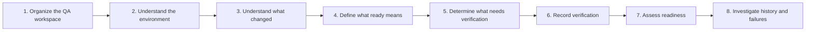

# QuVeTrail — User Story Map

> **Know what changed, what was verified, and what is ready.**

## Purpose

This map translates the Product Vision Board into the main activities users perform with QuVeTrail and the product-level tasks underneath them.

It does **not** define an MVP cut, implementation design, architecture, APIs, or delivery order.

## Backbone

## Story Map

```mermaid
flowchart LR

    subgraph A["1 · Organize the QA workspace"]
        direction TB
        A1["Create a project"]
        A2["Define test / pre-production environments"]
        A3["Give team members access"]
        A4["Connect delivery, test, and observability sources"]
    end

    subgraph B["2 · Understand the environment"]
        direction TB
        B1["See the current environment state"]
        B2["Inspect deployed components and versions"]
        B3["Inspect relevant configuration and feature flags"]
        B4["Inspect schema, dependencies, and test-data context"]
        B5["Know when and from where the state was recorded"]
    end

    subgraph C["3 · Understand what changed"]
        direction TB
        C1["Choose a previous or verified state as a baseline"]
        C2["Compare environment states"]
        C3["See application, deployment, configuration, schema, dependency, and data changes"]
        C4["Distinguish current state from historical state"]
    end

    subgraph D["4 · Define what ready means"]
        direction TB
        D1["Define a QA activity or readiness purpose"]
        D2["Define required environment conditions"]
        D3["Define required verification evidence"]
        D4["Maintain readiness rules as the product evolves"]
    end

    subgraph E["5 · Determine what needs verification"]
        direction TB
        E1["Relate changes to affected capabilities or workflows"]
        E2["See what verification is required for the current change"]
        E3["See what existing evidence is still applicable"]
        E4["See what remains unverified"]
    end

    subgraph F["6 · Record verification"]
        direction TB
        F1["Receive automated verification results"]
        F2["Record manual or exploratory verification"]
        F3["Bind evidence to the exact environment and change state"]
        F4["Inspect the source and details of verification evidence"]
        F5["Retain different evidence types, including UI, API, integration, contract, and performance"]
    end

    subgraph G["7 · Assess readiness"]
        direction TB
        G1["See the current readiness status"]
        G2["See which required areas are verified"]
        G3["See which conditions or evidence are missing"]
        G4["Understand why readiness or a quality gate passes or is blocked"]
        G5["Expose the readiness decision to delivery tooling"]
    end

    subgraph H["8 · Investigate history and failures"]
        direction TB
        H1["Browse environment and verification history"]
        H2["Inspect what was considered ready at an earlier point"]
        H3["Reconstruct the state behind an earlier verification result"]
        H4["Inspect the environment and changes around a failure"]
        H5["Compare failure context with later or current state"]
    end

    A1 ~~~ B1
    B1 ~~~ C1
    C1 ~~~ D1
    D1 ~~~ E1
    E1 ~~~ F1
    F1 ~~~ G1
    G1 ~~~ H1
```

## Activity Notes

### 1. Organize the QA workspace

Establish the product/system, environments, team access, and external sources that QuVeTrail will reason about.

### 2. Understand the environment

See the current QA-relevant state of an environment rather than relying on separate pipelines, dashboards, or messages.

### 3. Understand what changed

Compare the current state with an earlier or verified state and identify meaningful differences.

### 4. Define what ready means

Describe the conditions and evidence required before a particular QA activity or release decision can be considered ready.

### 5. Determine what needs verification

Translate a change into verification scope: what is affected, what evidence still applies, and what remains to be checked.

### 6. Record verification

Associate automated and manual verification evidence with the exact state it exercised.

### 7. Assess readiness

Evaluate current state and evidence and produce an explainable readiness result.

### 8. Investigate history and failures

Use retained state, change, and verification context to understand earlier decisions and failures.

## Mapping Back to the Product Vision

| Product Vision capability | Story-map activity |
|---|---|
| Environment state tracking | 2. Understand the environment |
| Change tracking | 3. Understand what changed |
| Readiness rules | 4. Define what ready means |
| Change-aware verification | 5. Determine what needs verification |
| Verification context / evidence | 6. Record verification |
| Verification status / explainable quality gates | 7. Assess readiness |
| Failure context | 8. Investigate history and failures |
| Multi-user access / integrations | 1. Organize the QA workspace |

## Next Planning Step

Review the backbone and tasks for missing or unnecessary user activities. Once the map is accepted, draw the first horizontal release slice across it. That slice will define the first MVP product scope; the Walking Skeleton remains a separate engineering milestone.
