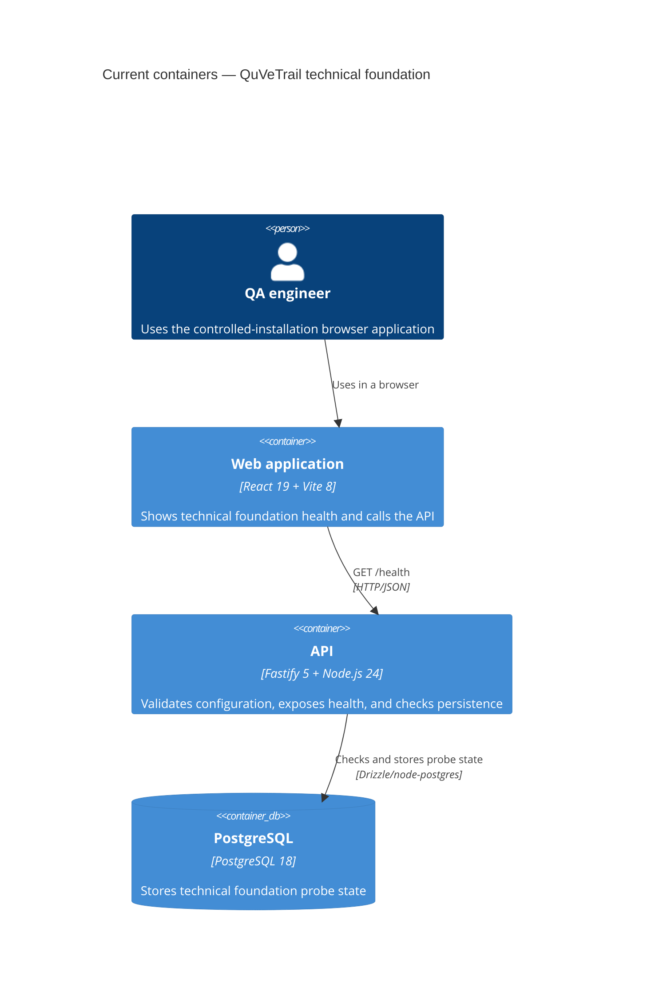

# Architecture map — QuVeTrail

> The **current** architecture (what exists today), produced by `survey` and read by
> specify / design / data-model / implement. Refresh with `survey` when the repo drifts past
> `reflects_commit`. This is generated; authored architecture and product-direction documents
> remain authoritative and are reconciled below.

## Stack

- Language / runtime: strict TypeScript using ES2023 and NodeNext, on Node.js 24.21.x with pnpm 12.8.1 (`tsconfig.base.json:2`, `package.json:6`).
- Backend: Fastify 5.12.5, Drizzle ORM 0.45.3, node-postgres 8.23.1, and Zod 4.6.5 (`apps/api/package.json:12`).
- Frontend: React 19.3.0 with Vite 8.3.2 (`apps/web/package.json:11`).
- Datastore and local runtime: PostgreSQL 18 Alpine under Docker Compose (`compose.yaml:3`).
- Build / test / quality gates: `pnpm build`, `pnpm test`, `pnpm check`, and the full real-system gate `pnpm verify` (`package.json:11`). There is no dedicated lint command (`docs/foundation-review.md:18`).

## C4 — system as it is

## Module inventory

| Module | Path | Layers | Wired at | Responsibility |
|---|---|---|---|---|
| Web application | `apps/web/` | presentation / HTTP client | `apps/web/src/main.tsx:1` | Renders the single foundation-health screen and calls the API without importing server internals. |
| API | `apps/api/` | entrypoint / transport / config / persistence | `apps/api/src/server.ts:1` | Composes Fastify, validated configuration, PostgreSQL access, migrations, and the technical persistence probe. |
| API migrations | `apps/api/drizzle/` | migration history | `apps/api/drizzle.config.ts:7` | Holds committed forward SQL generated from the editable Drizzle schema. |
| Deployed API tests | `tests/api/` | integration test | `vitest.api.config.ts:3` | Exercises the running API and PostgreSQL boundary. |
| Browser tests | `tests/e2e/` | end-to-end test | `playwright.config.ts:3` | Exercises the user-observable browser-to-API path and retains failure evidence. |
| Repository tools | `tools/` | validation / generation | `package.json:17` | Validates contracts and architecture policy independently of application runtime. |
| Command wrappers | `scripts/` | local / CI orchestration | `package.json:24` | Starts, verifies, diagnoses, and stops the Compose system through thin scripts. |

`apps/api/src/domain/` is reserved for future deterministic product rules but does not yet exist; no product domain module is currently implemented (`docs/project-map.md:19`).

## Conventions (cited — the rules a new feature must match)

- **Module wiring / registration:** construct the Fastify app around injected capabilities, then bind real configuration and persistence in the process entrypoint — `apps/api/src/app.ts:4`, `apps/api/src/server.ts:5`.
- **Error handling:** validate configuration with contextual errors, return HTTP 503 when the database is unavailable, and make entrypoint failures non-zero — `apps/api/src/config.ts:11`, `apps/api/src/app.ts:16`, `apps/api/src/server.ts:17`.
- **IDs:** no product ID convention exists. The singleton integer ID in `foundation_probe` is a technical smoke fixture and must not be generalized — `apps/api/src/schema.ts:3`, `apps/api/src/foundation-probe.ts:12`.
- **Persistence / DB access:** create a node-postgres pool, wrap it with Drizzle, and expose a narrow connectivity check at the adapter boundary — `apps/api/src/database.ts:1`.
- **Migrations:** edit `apps/api/src/schema.ts`, generate and review forward SQL under `apps/api/drizzle/`, and never rewrite an applied migration — `README.md:47`, `apps/api/drizzle.config.ts:7`.
- **Tests:** colocate focused app tests under each app's `test/unit`; keep deployed API tests in `tests/api` and browser paths in `tests/e2e` — `vitest.config.ts:3`, `vitest.api.config.ts:3`, `playwright.config.ts:3`.
- **Inter-module communication:** the web app calls the API through HTTP/JSON; the API accesses PostgreSQL through Drizzle/node-postgres. No events, broker, RPC, or shared application package exists — `apps/web/src/App.tsx:10`, `apps/api/src/database.ts:1`.
- **UI / styling:** use the existing plain global CSS and class modifiers. No component library, token system, or shared UI primitives exist yet — `apps/web/src/main.tsx:3`, `apps/web/src/styles.css:33`.

## Datastores

| Store | Engine | Accessed via | Notes |
|---|---|---|---|
| `postgres` | PostgreSQL 18 Alpine | Drizzle ORM over a node-postgres pool (`apps/api/src/database.ts:1`) | Compose owns a persistent `postgres-data` volume (`compose.yaml:70`). The only current table is the non-product `foundation_probe` smoke fixture (`apps/api/src/schema.ts:3`). |

## Frontend / UI foundation

- **Component library / design system:** none; the frontend currently consists of the root renderer and one `App` screen — `apps/web/src/main.tsx:1`, `apps/web/src/App.tsx:1`.
- **Design tokens:** no formal tokens or CSS custom properties; colors, spacing, typography, and radii are literal CSS values — `apps/web/src/styles.css:1`.
- **Styling approach:** one global plain-CSS stylesheet with class modifiers — `apps/web/src/main.tsx:3`, `apps/web/src/styles.css:33`.
- **Shared primitives:** none implemented; do not treat the health screen's markup as a component library — `apps/web/src/App.tsx:20`.
- **State / data-fetching:** local React `useState` / `useEffect` and browser `fetch`; no router, cache, or global state library — `apps/web/src/App.tsx:1`.
- **Closest UI precedent:** new foundation-level status feedback should match `App`'s checking, connected, unavailable, and `aria-live` behavior (`apps/web/src/App.tsx:3`).

## Where things live / closest precedents

- A new API capability belongs under `apps/api/src/`, with pure deterministic rules under `apps/api/src/domain/` only when real product logic exists; model composition and failure behavior on the health route (`apps/api/src/app.ts:4`).
- A new runtime configuration value belongs in the Zod schema and its focused tests, modelled on the PostgreSQL URL and port validation (`apps/api/src/config.ts:1`, `apps/api/test/unit/config.spec.ts:4`).
- A new persisted schema change starts in `apps/api/src/schema.ts` and produces a committed forward migration, modelled only mechanically on the technical probe migration (`apps/api/src/schema.ts:3`, `apps/api/drizzle/0000_foundation.sql:1`).
- A new screen belongs under `apps/web/src/`; until a design system is established, match the existing state feedback and accessibility precedent in `App` rather than inventing a parallel styling system (`apps/web/src/App.tsx:3`).

## Constraints & known tech-debt

- The current repository is a technical foundation shell, not an implemented readiness product; `foundation_probe` is explicitly not a product entity (`README.md:1`, `docs/project-map.md:9`).
- Browser code cannot import API or database internals, future deterministic domain code cannot import outer layers, and production code cannot import tests; `pnpm check:architecture` enforces these rules (`.dependency-cruiser.cjs:3`).
- Product domain rules, product APIs, product schema, and product screens are absent and remain governed by the accepted direction rather than the technical probe (`docs/direction-quvetrail.md:9`, `docs/foundation-plan.md:101`).
- No general product ID strategy, migration rollback mechanism, reusable contract record, or shared UI system is implemented (`docs/contracts/index.json:1`, `docs/foundation-review.md:24`).
- Production deployment and production assurance requirements remain intentionally unresolved and must not be inferred from the local Compose topology (`docs/project-charter.md:43`).

## Reconciliation with the authored architecture doc

There is no separate `docs/architecture.md`. This generated map agrees with the current implemented-system authority in `docs/project-map.md`: Browser → React/Vite → Fastify → PostgreSQL, with enforced web/API/domain/test boundaries. It also respects the accepted product direction and charter while distinguishing that target product outcome from the much narrower technical shell that exists today (`docs/project-map.md:5`, `docs/direction-quvetrail.md:3`, `docs/project-charter.md:12`).

`docs/foundation-plan.md` is classified as an executed historical plan because its baseline describes a documentation-only repository with no commands or source (`docs/foundation-plan.md:3`), while `docs/foundation-review.md` records the resulting implemented and verified foundation (`docs/foundation-review.md:14`). The broader product vision, story map, and walking-skeleton delivery documents remain future planning context; they do not authorize unimplemented containers or product modules in this current-state map (`docs/direction-quvetrail.md:110`).
