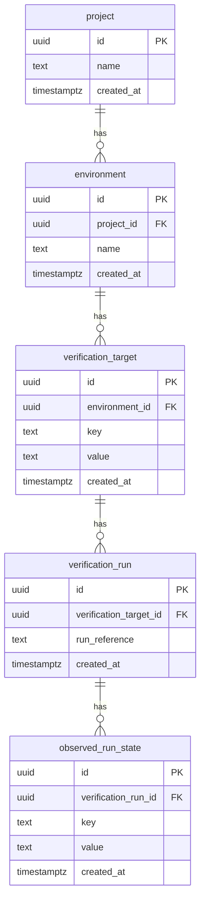

# Data model — walking-skeleton-readiness

## ER diagram

## Current hierarchy validity (AC-20)

A reliable workspace read selects the visible accepted Project with the greatest UUID by `ORDER BY id DESC LIMIT 1`, then the greatest-UUID Environment **within that Project**, the greatest-UUID Verification Target **within that Environment**, and the greatest-UUID Verification Run **within that Target**. This is the definition of “current”, including after repeated creates; “latest” means greatest UUID, not exact acceptance/commit chronology (ADR-0005). Each selected child must refer to its selected parent. The selected Run must have **exactly one** Observed Run State whose `verification_run_id` equals that Run’s `id`; do not select only the greatest-UUID state and hide duplicates.

**Read invariant:** one workspace read → one coherent view of the selected hierarchy. All selections above, including child absence and the selected Run's associated state/count, share one database visibility snapshot, as required by [SAD §6 coherent workspace read](./sad.md#6-runtime-view). Independently advancing snapshots must not be assembled into one result, even if all returned parent links are valid. Concurrent acceptance may appear in this view or a later read; it cannot change the selected hierarchy halfway through this read. Failure to establish a coherent reliable view is `UNAVAILABLE`; the implementation mechanism remains T3's choice.

| Read result | Classification / result |
|---|---|
| No Project; all selected descendants absent | Valid empty workspace; null Evidence Status. |
| Project only, or Project → Environment | Valid partial hierarchy; null Evidence Status. |
| Project → Environment → Target, no Run | Valid partial hierarchy; `NO_EVIDENCE` (UI workflow guidance). |
| Project → Environment → Target → Run → exactly one associated state | Valid complete hierarchy; derive `MATCH` / `MISMATCH`. |
| A selected child lacks its selected parent or refers to a different parent; selected Run has zero or multiple associated states, or a returned state belongs to another Run | Unreliable/inconsistent current hierarchy; `UNAVAILABLE`. |
| Database/query failure while reading the selected chain | Unreliable read; `UNAVAILABLE`, never successful absence. |

Missing children before a Run exists are valid partial states. Rows on older/non-current parent branches are outside this predicate and do not by themselves make the selected hierarchy inconsistent. This is a bounded current-chain check, not a scan of database integrity.

Persisted textual values inserted outside application acceptance are **not** revalidated for non-empty/trimmed content as AC-20 corruption detection. Trim/non-empty validation remains an acceptance rule (AC-14a); readable stored strings use the existing trim/case-sensitive comparison rule without an additional corruption classification. No new string CHECK, repair, or integrity framework is introduced.

`created_at DEFAULT now()` is the PostgreSQL transaction timestamp assigned during the acceptance transaction, not the exact commit time. Only successful commit makes a record accepted (AC-17); timestamp assignment does not prove acceptance.

## Transaction acceptance outcomes (AC-16 / AC-16a / AC-17)

Run + Observed Run State remain one transaction: PostgreSQL commits both or neither. Atomicity does not imply the API always knows which occurred. The persistence adapter reports confirmed commit, known non-acceptance, or unknown acceptance under [SAD §6](./sad.md#6-runtime-view) / [ADR-0002](./adr/0002-transactional-record-acceptance.md). Only known non-acceptance permits retry-safe `SAVE_FAILED`. An uncertain COMMIT may have persisted both rows; its error must not be tested or represented as necessarily leaving both absent.

No schema delta, outcome record, idempotency key, or persisted operation status is added. The existing reliable GET restores the selected accepted hierarchy. Absence in a GET snapshot is not proof that an uncertain transaction cannot commit later; recovery does not identify or deduplicate the attempted create. Tests control completion before inspecting final rows and distinguish their fixture's known ground truth from the API's knowledge at response time.

## Entities

Conventions followed (detected from `apps/api/drizzle/0000_foundation.sql`, `apps/api/src/schema.ts`, `docs/architecture-map.md` §Migrations, and the Accepted ADRs): snake_case singular table names, quoted identifiers, `text` for strings (no length limits in spec §5), `timestamp with time zone DEFAULT now()` audit column, no `CHECK` constraints (the repo uses none), app-layer UUID v7 primary keys (ADR-0005), one transaction per accepted record (ADR-0002).

### `project`

| Column | Type | Constraints | Notes |
|---|---|---|---|
| `id` | uuid | PK, NOT NULL, app-generated (UUID v7) | Time-sortable (ADR-0005); "current Project" selection uses `ORDER BY id DESC LIMIT 1`. |
| `name` | text | NOT NULL | Non-empty after trimming, enforced at the application layer (AC-01/AC-02, AC-14a); stored already trimmed; case preserved. |
| `created_at` | timestamp with time zone | NOT NULL DEFAULT now() | Timestamp assigned during the acceptance transaction; not the commit instant. |

**Aggregate root:** root.
**Access patterns:** insert on AC-01 happy path; read "current Project" on every workspace load (US-02/03/04 context reads, Critical flow 2) — greatest-UUID row read.
**Constraints:** no UNIQUE (deliberate — SAD §11: the one-record workspace is UI scope, not a schema singleton or duplicate-create rejection; repeated creates use the current-selection rule above).

### `environment`

| Column | Type | Constraints | Notes |
|---|---|---|---|
| `id` | uuid | PK, NOT NULL, app-generated (UUID v7) | |
| `project_id` | uuid | NOT NULL, FK → `project(id)` | Indexed (`environment_project_id_idx`). |
| `name` | text | NOT NULL | Non-empty after trimming, application layer (AC-03/AC-05). |
| `created_at` | timestamp with time zone | NOT NULL DEFAULT now() | |

**Aggregate root:** root (linked upward to Project by FK — a separate aggregate, per the confirmed four-roots decision).
**Access patterns:** insert on AC-03; read "current Environment within the Project" for Target/Run prerequisites and workspace load → index `environment_project_id_idx`.
**Constraints:** FK → `project(id)` (default NO ACTION — no delete behavior is implemented this slice); no UNIQUE on `project_id` (SAD §11).

### `verification_target`

| Column | Type | Constraints | Notes |
|---|---|---|---|
| `id` | uuid | PK, NOT NULL, app-generated (UUID v7) | |
| `environment_id` | uuid | NOT NULL, FK → `environment(id)` | Indexed (`verification_target_environment_id_idx`). |
| `key` | text | NOT NULL | Non-empty after trimming, application layer (AC-06/AC-08); stored trimmed, compared case-sensitively (AC-14a). |
| `value` | text | NOT NULL | Same validation and comparison rules as `key`. |
| `created_at` | timestamp with time zone | NOT NULL DEFAULT now() | |

**Aggregate root:** root (comparison context — NOT a deployment instruction, per CONTEXT.md).
**Access patterns:** insert on AC-06; read "current Verification Target within the Environment" for Run prerequisite and MATCH/MISMATCH derivation → index `verification_target_environment_id_idx`.
**Constraints:** FK → `environment(id)`; no UNIQUE on `environment_id` (SAD §11).

### `verification_run`

| Column | Type | Constraints | Notes |
|---|---|---|---|
| `id` | uuid | PK, NOT NULL, app-generated (UUID v7) | |
| `verification_target_id` | uuid | NOT NULL, FK → `verification_target(id)` | Indexed (`verification_run_verification_target_id_idx`). |
| `run_reference` | text | NOT NULL | External run identifier; non-empty after trimming, application layer (AC-10/AC-12); a trusted user assertion (spec §6.1). |
| `created_at` | timestamp with time zone | NOT NULL DEFAULT now() | |

**Aggregate root:** root of the run aggregate (run + its Observed Run State, accepted in one transaction — ADR-0002, US-04).
**Access patterns:** insert on AC-10/AC-11; read "current Verification Run for the Target" during status derivation and workspace load → index `verification_run_verification_target_id_idx`.
**Constraints:** FK → `verification_target(id)`; no UNIQUE on `verification_target_id` (SAD §11). No outcome columns — test-run outcomes are out of scope (spec §3, ADR-0003).

### `observed_run_state`

| Column | Type | Constraints | Notes |
|---|---|---|---|
| `id` | uuid | PK, NOT NULL, app-generated (UUID v7) | |
| `verification_run_id` | uuid | NOT NULL, FK → `verification_run(id)` | Indexed (`observed_run_state_verification_run_id_idx`). |
| `key` | text | NOT NULL | Non-empty after trimming, application layer (AC-10/AC-12); compared case-sensitively against `verification_target.key` (AC-14). |
| `value` | text | NOT NULL | Same rules as `key`. |
| `created_at` | timestamp with time zone | NOT NULL DEFAULT now() | |

**Aggregate root:** child entity of the `verification_run` aggregate — always accepted with its run in one transaction (US-04 flow, ADR-0002), never independently.
**Access patterns:** insert together with the run (AC-10/AC-11); read joined to its run for the AC-14 exact-equality comparison → index `observed_run_state_verification_run_id_idx`.
**Constraints:** FK → `verification_run(id)`; the FK makes the CONTEXT.md invariant "Observed Run State remains associated with its run" structural.

## Indexes

| Index | Columns | Query it serves |
|---|---|---|
| `environment_project_id_idx` | `environment(project_id)` | Workspace load / recovery: current Environment within the current Project (US-02/03/04 "read current context" steps, Critical flow 2); also the universal FK-read hygiene index. |
| `verification_target_environment_id_idx` | `verification_target(environment_id)` | Current Verification Target within the current Environment (US-03/04 prerequisites, status derivation reads). |
| `verification_run_verification_target_id_idx` | `verification_run(verification_target_id)` | Current Verification Run for the current Verification Target (US-04/US-05 derivation, AC-09 no-run branch needs the absence proven cheaply). |
| `observed_run_state_verification_run_id_idx` | `observed_run_state(verification_run_id)` | Observed Run State joined to its run for the AC-14 key/value exact-equality comparison. |

No other indexes: every candidate above traces to a concrete `reads <entity>` note in the sad.md §6 sequences; there is no listing, search, or history query in this slice. Current-record reads use `ORDER BY id DESC LIMIT 1`, served by the PK plus the FK index above, with the selection semantics defined above.

## Test fixtures

Test data is generated as colocated factory functions (the repo's vitest colocated convention — `apps/api/test/unit`), never as migration seeds:

- `aProject(overrides?)` — a full `project` row: deterministic UUID v7, name `"Test Project"` (or override).
- `anEnvironment(overrides?)` — an `environment` row linked to a generated project (or a given `projectId`).
- `aVerificationTarget(overrides?)` — a `verification_target` row with `key = "test-key"`, `value = "test-value"` by default.
- `aVerificationRun(overrides?)` — a `verification_run` row with `runReference = "run-001"` linked to a target.
- `anObservedRunState(overrides?)` — usually built via `aRunWithState({ target, observedKey, observedValue })`, which produces the run + state aggregate pair the application accepts in one transaction.

No PII guard concern beyond using obviously fictional technical names (`Test Project`, `test-key`); the model has no person-related fields (no auth, no user accounts — spec §6.1).
