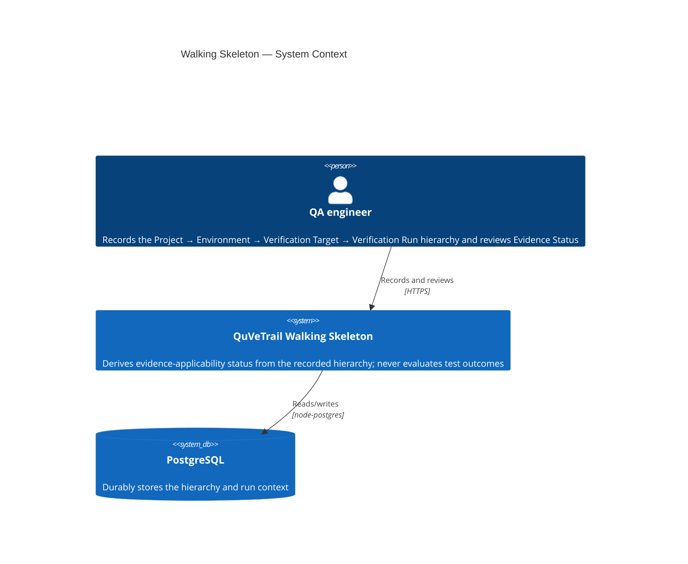
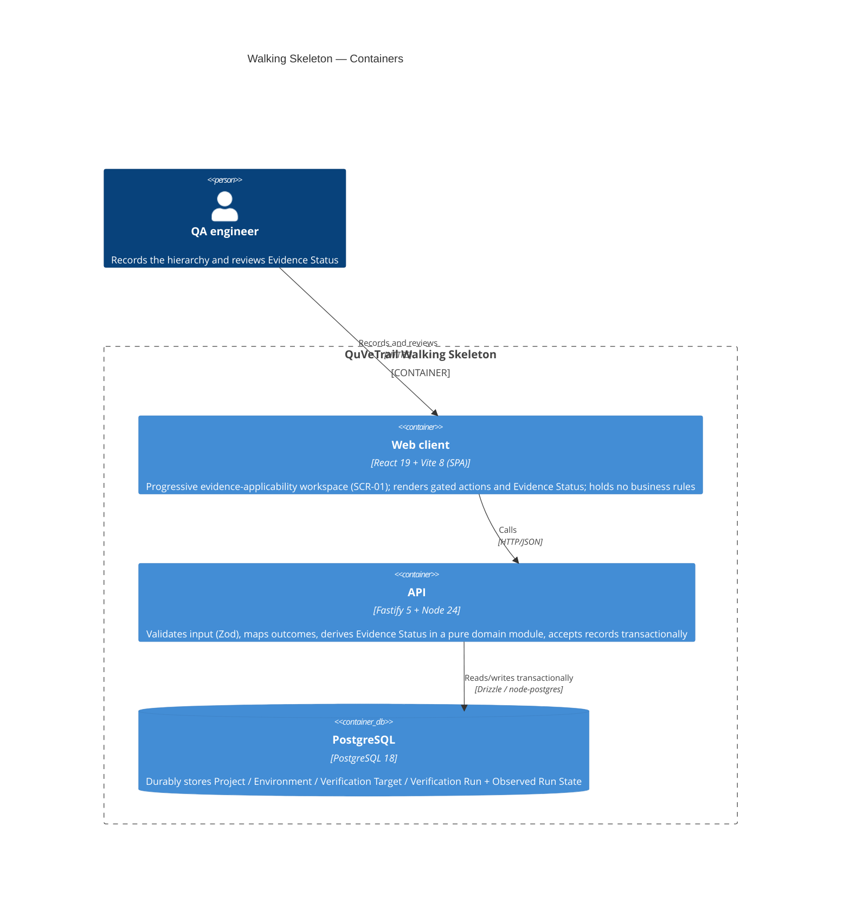
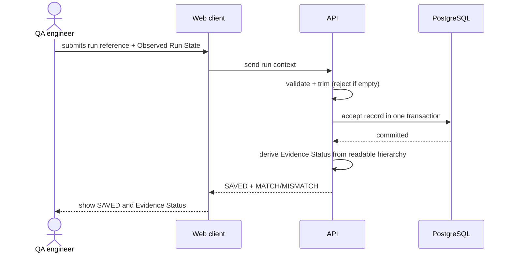
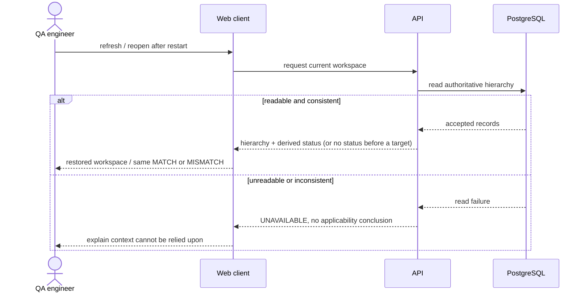
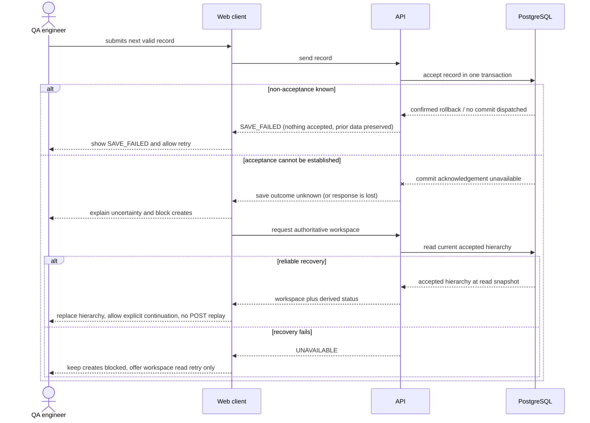
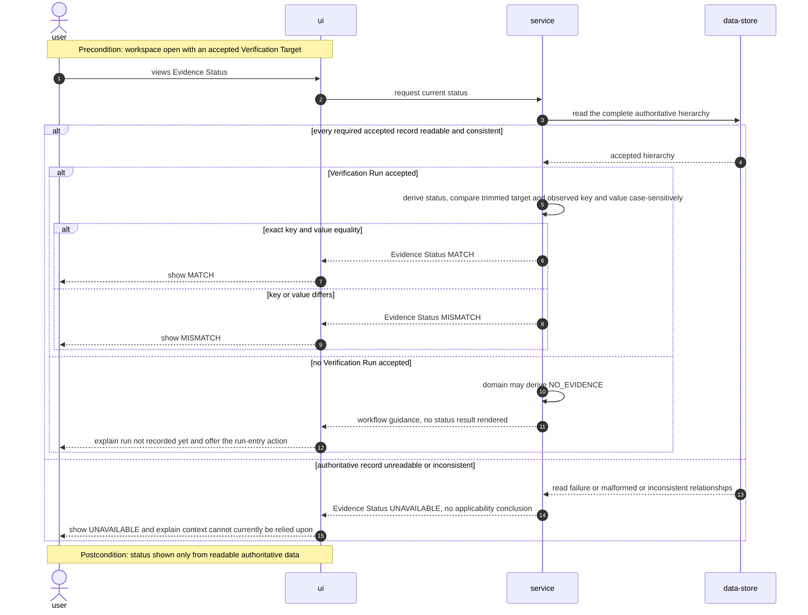
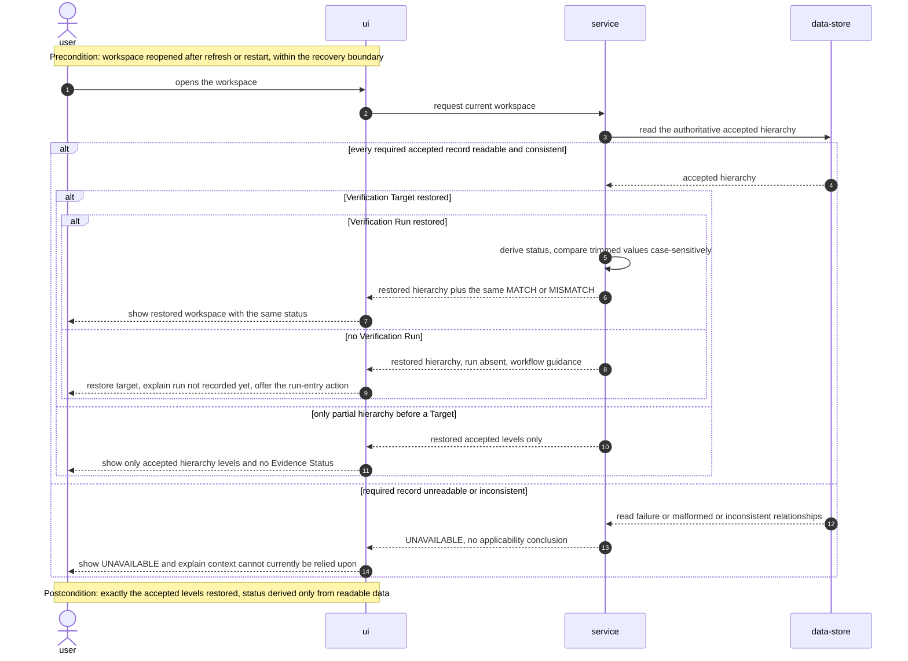

# Software Architecture Document — walking-skeleton-readiness

<!-- 12 Arc42 sections. Empty section → <!-- N/A: <one-line reason> -->. -->
<!-- C4 Context (L1) lives inline in §3. C4 Container (L2) lives inline in §5. -->
<!-- Numbers in §10 come VERBATIM from spec.md §6 NFR — no inventing, no rounding. -->

## 1. Introduction and goals

**Intent.** QuVeTrail's Walking Skeleton proves the smallest real product flow across the intended boundaries: a QA engineer progressively records the Project → Environment → Verification Target → Verification Run hierarchy in a browser workspace, and QuVeTrail derives an Evidence Status that distinguishes missing evidence, matching context, mismatching context, and unavailable authoritative data — without evaluating test outcomes. The proof is the durable target-to-run-context relationship and trustworthy recovery: refresh or restart restores the accepted hierarchy and reproduces the same Evidence Status.

**Top-3 quality goals (1-liners; full scenarios in §10):**

1. Applicability correctness — `MATCH` iff the accepted Verification Target key and value exactly equal the accepted Observed Run State key and value (trimmed, case-sensitive); never confusable with test outcome or Readiness.
2. Durability under failed saves — retry-safe `SAVE_FAILED` requires known non-acceptance; unknown acceptance requires recovery; nothing shows `SAVED` or feeds Evidence Status from a submission before durable acceptance is known.
3. Recoverability — refresh or restart within the recovery boundary restores the accepted hierarchy and derives the same Evidence Status; unreadable authoritative data yields `UNAVAILABLE`, never a guessed conclusion.

**Stakeholders.**

| Role | Interest | Sign-off owner? |
|---|---|---|
| QA engineer | Records the hierarchy and reviews Evidence Status | No |
| Tech Lead | SAD approval; owns the production NFR revisit (§11) | Yes |
| Security Lead | §6.1 security-review scope | No |

<!-- Decision overrides (¶4) — populated by the critic resolution loop, empty otherwise. -->

## 2. Constraints

**Technical.**
- TypeScript (strict, ES2023, NodeNext) on Node.js 24.21.x with pnpm 12.8.1.
- API: Fastify 5.12.5, Zod 4.6.5. Persistence: Drizzle ORM 0.45.3, node-postgres 8.23.1.
- Web: React 19.3.0 + Vite 8.3.2, plain global CSS (no component library or token system yet).
- Datastore: PostgreSQL 18 Alpine under Docker Compose with a persistent `postgres-data` volume.
- Architecture convention: two-package monorepo (`apps/api`, `apps/web`) with enforced dependency boundaries (web cannot import API/database internals, deterministic domain cannot import outer layers) checked by `pnpm check:architecture`.

**Organisational.**
- Effort budget: size M — separate epic, 1–2 sprints.
- Deadline: none specified — `<TBD by PM>` (tracked in §11).
- Team composition: one small team; the product assumes one trusted QA engineer in a controlled installation.

**Conventions.**
- `docs/project-map.md` + `docs/architecture-map.md` (fresh — `reflects_commit` is an ancestor of HEAD): wiring around injected capabilities, contextual config errors, HTTP 503 on database unavailability, Drizzle migrations under `apps/api/drizzle/` (edit `apps/api/src/schema.ts`, never rewrite an applied migration), colocated unit tests under each app's `test/unit`, deployed API tests in `tests/api`, browser paths in `tests/e2e`.
- IDs: no product ID convention exists yet — decided in §8 (→ ADR).
- Error handling: validate with contextual errors; the domain → HTTP outcome mapping is defined in §8.

**Regulatory / external.**
- N/A — controlled informational skeleton; no compliance scope; data is context-dependent technical metadata with no secret-bearing fields (spec §6.1).

## 3. Context and scope

QuVeTrail holds the QA engineer's verification workspace: they record a Project, an Environment within it, the Verification Target (the required configuration), and optionally an external Verification Run with its Observed Run State. QuVeTrail derives Evidence Status from that data — applicability only, never test outcomes. The trust boundary ends at the browser: external-run details are trusted user assertions (spec §6.1).

<!-- brownfield: docs/architecture-map.md is fresh (reflects_commit is an ancestor of HEAD) — React/Vite web app + Fastify API + PostgreSQL 18, no events/broker; foundation_probe is a non-product smoke fixture. -->

**External systems (in / out):**

| Actor or system | Type | Interaction |
|---|---|---|
| QA engineer | Person | Records the hierarchy, reviews Evidence Status, retries failed saves |
| PostgreSQL 18 | System (internal datastore) | Durably stores the hierarchy and run context |

**C4 Context (L1):**



## 4. Solution strategy

**Top strategic choices (the seeds for ADRs):**

1. **Two surfaces — a backend-service API and a web-frontend browser client** — the QA engineer works in a progressive browser workspace (spec §1, ux-flows SCR-01), while validation, durability, and Evidence Status derivation live behind the Fastify API with PostgreSQL. Declaring both surfaces drives the §5 container view and the HTTP contract every downstream stage reads. → ADR-0001.
2. **Synchronous request-scoped transactional acceptance** — each hierarchy record is accepted inside a single PostgreSQL transaction; the API returns `SAVED` only after confirmed durable commit, `SAVE_FAILED` only after known non-acceptance, and `*.save_outcome_unknown` when acceptance cannot be established. This is the durability invariant behind QG-2 and AC-16/16a/17: nothing shows `SAVED` or feeds Evidence Status from the submitted record before durable acceptance is known. → ADR-0002.
3. **Derive Evidence Status at read time in a pure domain module** — status is never stored; a pure function in `apps/api/src/domain/` computes it from the readable hierarchy on each read, so the same persisted state always yields the same status after refresh/restart (AC-18/19) and `UNAVAILABLE` arises from a read failure, not from stored state. A future Readiness/audit slice may layer a persisted decision-record (with reasoning) on top as a separate concept — an evaluation deferred in §11, not a change to this slice. → ADR-0003.
4. **SPA with server-authoritative state** — the React SPA calls the API and, on load/refresh/restart, re-fetches the persisted hierarchy and re-derives from the server rather than trusting any client cache; client state is minimal (in-flight form + last operation outcome), no router at this size. This is what makes refresh/restart recovery (AC-18/19) real and matches the existing `App.tsx` precedent. → ADR-0004.

Each tactical decision in later sections traces to one of these seeds. Tactical decisions that *contradict* a strategic choice are red flags — surface them in §11.

## 5. Building block view

<!-- 🎯 Why: INTERNAL DECOMPOSITION — modules, containers, datastores. The static topology: who
     may talk to whom. Without §5, §6 (the flows) has no vocabulary of participants.
     📋 Write: 1 ¶ on the style (layered / hexagonal / clean / event-driven) + a folder tree + a
     C4Container block.
     📌 Draw ONE Container per declared `target_surface` (frontmatter): a fullstack
     [backend-service, web-frontend] = a backend-API container + a web/SPA container; a
     [backend-service, mobile-app] = the API + the mobile app. The Container(web, …) line below is
     just one surface's container — swap/add per what was declared in §4. → _shared/surfaces.md
     📌 e.g. «web app, content API, media worker, datastore, object store, CDN». -->

The API is a layered (hexagonal-leaning) service: transport (Fastify handlers) → application (use-cases) → domain (pure deterministic rules: Evidence Status derivation, trimming/comparison); application → repository abstraction ← infrastructure implementation (Drizzle over node-postgres). Deterministic domain logic has no I/O and no dependency on outer layers, per the repo convention (`docs/project-map.md`). The web client is a thin SPA that calls the API and holds no business rules. Chosen because durability and derivation correctness (QG-1/QG-2) must be provable without the UI. The current architecture gate protects foundation paths; T3 extends it to the planned application/domain boundaries below.

**Internal decomposition:**

```
apps/api/src/
├── domain/              # pure: deriveEvidenceStatus, trim/compare, hierarchy invariants — no I/O
├── app/                 # use-cases plus workspace-repository.ts: application-facing persistence contract (T3)
├── infra/               # workspace-repository.ts: Drizzle/node-postgres implementation (T3); transaction evidence
├── ports/http/          # route-local DTOs/outcome mapping; request-policy.ts: shared body/error policy (T7)
└── app.ts / server.ts   # composition root: construct app around injected capabilities, bind persistence in the entrypoint

apps/web/src/
├── main.tsx / App.tsx   # progressive workspace (SCR-01): gated actions, status feedback, aria-live
└── api/                 # typed fetch client — the only web→system seam
```

**Persistence seam and ownership (planned, not implemented):** T3 establishes `apps/api/src/app/workspace-repository.ts` and its first implementation in `apps/api/src/infra/workspace-repository.ts` together. The contract contains only the current hierarchy reads, four acceptance operations (Run/State together), plain record/input types, and committed / known-not-accepted / unknown result types required by T4/T5/T6. It may reuse T2 domain types, but exposes no Drizzle schema-derived types, node-postgres handles, Fastify/Zod types, HTTP status codes, or concrete factory. Do not add a general ports hierarchy or DI framework.

T4/T5/T6 import the application contract and inject structural test doubles; they cannot import or re-export infrastructure. Infrastructure imports/implements the application contract, not the reverse; domain imports neither application nor transport/persistence. T9 constructs the concrete adapter in `server.ts` using the existing `createDatabase` connection, then injects the contract through `buildApp` in `app.ts`, which composes use cases and routes. HTTP routes depend on use cases, not the adapter. Only `server.ts` binds the concrete product repository. T3 alone owns the contract/adapter files; downstream consumers are read-only there and return any needed seam change to T3's scope before proceeding.

**Planned gate correction (T3):** the current `.dependency-cruiser.cjs` domain rule only names foundation root files, misses `app/`, `infra/`, and `ports/`, and has no application rule. T3 extends `no-domain-to-outer-layers` to these planned directories and adds `no-application-to-outer-layers` from `apps/api/src/app/` to transport, infrastructure, and the existing root transport/persistence/composition files (`app.ts`, `database.ts`, `foundation-probe.ts`, `migrate.ts`, `schema.ts`, `server.ts`). Both rules also reject direct imports of the outer implementation packages used here (`fastify`, `@fastify/*`, `drizzle-orm`, `pg`, including subpaths and type-only imports). Domain cannot import the repository contract; application can import domain; infrastructure can import the application contract. Composition roots remain outside the application directory. T3 adds focused negative sentinels and allowed-direction checks in `tools/test-architecture-gate.mjs`; the canonical command remains `pnpm check:architecture`. This closes the concrete seam gap without adding general layer, cycle, or complexity policy. Route → use-case imports and server-only concrete factory binding remain explicit ownership/review checks for this slice rather than additional gate rules. Until T3 implements this update, a passing gate does not prove these planned boundaries. `docs/project-map.md` and `docs/architecture-map.md` continue to describe implemented state; T16 refreshes them after implementation.

**C4 Container (L2):** <!-- one Container per declared target_surface (frontmatter): web-frontend + backend-service. -->



## 6. Runtime view

<!-- 🎯 Why: the RUNTIME FLOW of 1–2 critical scenarios — who talks to whom, when, in what order.
     Without §6, §5 is just boxes with no life.
     📋 Write: a Mermaid sequenceDiagram. Participants are names from §5 (don't invent new ones).
     Messages are semantic («saves a draft»), NO HTTP verbs / paths / status codes — endpoint-level
     sequences arrive at the `api` stage.
     📌 e.g. «author → web: composes draft → web → content API: save». Seed the primary flow(s) here;
     the `sequences` stage then covers every §5 AC (no cap). Never N/A for M+; XS/S keeps ≥1 happy-path flow. -->

**Authoritative hierarchy validity:** AC-20 uses the bounded predicate in [data-model.md §Current hierarchy validity](./data-model.md#current-hierarchy-validity-ac-20): parent-scoped current selection, valid partial levels, and exactly one state for the selected Run. Older branches and externally inserted empty/untrimmed strings do not trigger a broader corruption scan.

**Current selection semantics:** select the greatest visible accepted UUID at each parent-scoped level (`ORDER BY id DESC LIMIT 1`), including after repeated creates and recovery. UUID v7 sorting does not guarantee exact acceptance/commit chronology; same-millisecond IDs, clock skew and transaction completion may interleave (ADR-0005). Use the same deterministic rule for prerequisite reads and workspace reads, without a chronology column.

**Coherent workspace read (T3):** one workspace read → one coherent view of the selected hierarchy. Project selection, every parent-scoped descendant selection, and the selected Run's state/count must use the same database visibility snapshot; derive Evidence Status only from that view. Concurrent acceptance, including completion of an uncertain transaction, may be visible to this read or a later read, but must not change visibility halfway through one result. Parent-linked rows alone are insufficient if they were selected at unrelated visibility points. T3's repository contract guarantees this property; the adapter may use a suitable single SQL statement, a transactionally consistent read, or another PostgreSQL/Drizzle approach that provides it. A transaction alone is not proof if its statements can observe different snapshots. If a coherent reliable read cannot be established, return `UNAVAILABLE` under AC-20.

**Server transaction acceptance outcomes (all four creates):** the persistence adapter owns the evidence at the API ↔ PostgreSQL boundary, exposing a narrow three-way result to application use cases. Domain logic does not classify I/O errors; application/HTTP layers must preserve the adapter's knowledge rather than converting every exception to `SAVE_FAILED`.

| Adapter result | Evidence required | HTTP / browser meaning |
|---|---|---|
| Confirmed committed | The acceptance transaction's COMMIT is acknowledged as committed, under the existing durable PostgreSQL configuration. Insert results or transaction callback completion alone are insufficient. | `201` with `outcome: SAVED`; committed inputs may feed Evidence Status. |
| Known not accepted | No COMMIT was dispatched and the adapter guarantees none can subsequently be dispatched for that attempt; or PostgreSQL definitively confirms rollback/non-commit of that transaction. Includes acquisition/BEGIN failure, parent-read failure before acceptance writes, and statement failure before COMMIT with controlled rollback/connection disposal. | `503` with the operation-specific `*.save_failed`; nothing of this attempt accepted, prior rows unchanged, user may retry the POST. Validation/prerequisite rejections retain their existing 400/409 contracts. |
| Acceptance unknown | COMMIT may have been dispatched but no definitive commit/non-commit acknowledgement is available, including connection failure/timeout while COMMIT is in flight; or available transaction evidence cannot reliably distinguish the outcome. | `503` with the operation-specific `*.save_outcome_unknown` in the existing `{code,message,details?}` envelope, with no record, `SAVED`, or Evidence Status. Browser recovers via GET before continuing. |

**Adapter implementation boundary (T3):** keep one leased node-postgres client for BEGIN, all Drizzle statements, and COMMIT/ROLLBACK. Control the transaction lifecycle in the adapter so it observes whether COMMIT may have been dispatched and the acknowledged command result. A resolved COMMIT query must actually report commit, not a rollback command result. The current `apps/api/src/database.ts` supplies only pool/Drizzle handles and health checks; it supplies no acceptance evidence. The installed Drizzle 0.45.3 `NodePgSession.transaction` awaits COMMIT then attempts ROLLBACK on any caught error, discarding the commit command result and potentially replacing the original error with a rollback error. Catching that wrapper's rejection is therefore insufficient proof of non-commit; T3 owns the narrow lifecycle control, while continuing to use Drizzle for record statements on that client.

No arbitrary error class/message, generic DB exception, local timeout, or cancellation request proves rollback. A ROLLBACK acknowledged **after an uncertain COMMIT** may be a no-op on an already committed transaction; it cannot turn unknown into known non-acceptance. Before-COMMIT failure must prevent later COMMIT dispatch and rollback or discard the affected connection; an uncertain/broken client must not return to the pool as reusable. Cleanup errors must not overwrite acceptance evidence. Once commit is known, subsequent read/serialization/response-delivery failure cannot become `*.save_failed`; an unusable/lost response goes through browser recovery. Neither adapter nor use case automatically retries an acceptance transaction.

**Browser acceptance outcomes:** only a valid received response matching the operation's `503 *.save_failed` contract means non-acceptance is known. Show `SAVE_FAILED`, retain previously accepted data/input, and allow user-initiated POST retry. A valid `201 SAVED` confirms acceptance. A received `503 *.save_outcome_unknown`, POST transport/network failure (including response loss after commit), or unrecognized/unusable POST response leaves acceptance **unknown**: do not show `SAVE_FAILED`, `SAVED`, or automatically repeat the POST. Explain that the save outcome could not be confirmed, block all creates while recovering, and reload `GET /api/v1/workspace` first. On success replace the displayed hierarchy with recovered server state, deriving status only from that reliable read, and continue from it; do not infer `SAVED` for the uncertain attempt. If recovery fails, show `UNAVAILABLE`, no applicability conclusion, and offer retry of the **GET**, keeping creates blocked. Unknown acceptance is operation feedback, not a new Evidence Status.

**Recovery limit:** GET establishes the selected current hierarchy at its read snapshot, not the uncertain transaction's historical outcome. Absence is not proof of rollback, especially if that transaction is still completing. After a reliable GET, a subsequent create is an explicit user action from the recovered context, never automatic replay or a promised duplicate-free retry. Repeated creates and current-hierarchy selection remain unchanged; no ID lookup endpoint, idempotency key, command log, or other reconciliation machinery is added.

**Boundary evidence:** [PostgreSQL 18 protocol](https://www.postgresql.org/docs/18/protocol-flow.html#PROTOCOL-FLOW-SIMPLE-QUERY) separates command completion from errors; [node-postgres transactions](https://node-postgres.com/features/transactions) require one client for the transaction. The unknown-outcome rule above is the conservative inference when completion acknowledgement is unavailable, not a claim that any particular exception proves commit or rollback.

**Request validation boundary:** strict Zod DTOs reject missing properties, wrong JSON types, and unexpected properties (including nested ones) before use cases or writes. Normalize these and JSON-body parse failures into the contract’s HTTP 400 `request.invalid_body` envelope, not default Fastify/Zod shapes. Domain empty-after-trim errors retain their existing operation-specific codes. See OpenAPI for deterministic `details.fields` mapping. T7 owns `apps/api/src/ports/http/request-policy.ts`: strict-body validation/error normalization and a reusable scoped Fastify error handler for malformed JSON/absent bodies. T7's context routes and T8's evidence routes each install that same policy inside their encapsulated route-registration scope before registering POST handlers; parser errors must be caught even before a handler runs. T8 depends on T7 and consumes the helper read-only. Feature DTO definitions and operation-specific 400/409/503 mappings stay in their route files. Shared policy reports sorted/deduplicated dotted paths, full rejected-key paths for unexpected properties, and `$` for body-level failures (absent body, malformed JSON, non-object root), with a readable message and no framework-default body. T7 proves nested/multiple-path behavior with test-local DTOs; T8 proves it on the real nested Run DTO. T9 mounts both registrations and proves the same policy on all four POSTs without moving it into the root app or changing `/health`.

**Simultaneous domain validation:** after structural validation succeeds, evaluate all accepted-text inputs. Target code precedence is `key`, `value`; Run precedence is `run_reference`, `observed_run_state.key`, `observed_run_state.value` (Project/Environment each have only `name`). The first empty-after-trim field in that order supplies its existing code; return all failing paths sorted/deduplicated in `details.fields`, with no writes. Property order is irrelevant. The UI renders a non-empty-after-trim explanation at every known path rather than using the primary code/message as the sole inline error. T2 provides pure input validation, T5 assembles the operation result, T8 preserves it over HTTP, and T10/T11 preserve/display all fields. Structural errors remain exclusively `request.invalid_body` under T7's shared policy.

**Critical flow 1: Record a Verification Run and derive Evidence Status (happy path)**



**Critical flow 2: Recover the workspace after refresh/restart**



**Critical flow 3: Known non-acceptance permits retry; unknown acceptance requires recovery**



### US-01 — Create Project

```mermaid
sequenceDiagram
    autonumber
    actor U as user
    participant W as ui
    participant S as service
    participant D as data-store

    Note over U,W: Precondition: workspace open, no Project accepted yet
    U->>W: submits Project name
    W->>S: send Project name
    S->>S: trim value, preserve remaining characters, reject if empty
    alt name non-empty after trimming
        S->>D: accept Project in one transaction
        Note over S,D: persists Project (informs data-model indexes)
        D-->>S: committed
        S-->>W: SAVED, Project becomes the current context
        W-->>U: show SAVED in Project context
    else name empty after trimming
        S-->>W: VALIDATION_ERROR
        W-->>U: show VALIDATION_ERROR and allow retry
    end
    Note over U,W: Postcondition: known acceptance or known rejection; storage failures use Critical flow 3
```

### US-02 — Create Environment

```mermaid
sequenceDiagram
    autonumber
    actor U as user
    participant W as ui
    participant S as service
    participant D as data-store

    Note over U,W: Precondition: dependent action offered only after its parent record is durably accepted (no Environment action without a Project)
    U->>W: chooses Environment action
    W->>S: send Environment name
    S->>S: read current Project context, trim value, reject if empty
    alt Project exists and name non-empty after trimming
        S->>D: accept Environment in one transaction within the Project
        Note over S,D: persists Environment linked to Project (informs data-model indexes)
        D-->>S: committed
        S-->>W: SAVED, Verification Target action unlocked
        W-->>U: show SAVED
    else name empty after trimming
        S-->>W: VALIDATION_ERROR
        W-->>U: show VALIDATION_ERROR and allow retry
    else no Project accepted
        S-->>W: prerequisite missing, Environment requires a Project context
        W-->>U: keep action unavailable and explain prerequisite
    end
    Note over U,W: Postcondition: known acceptance or known rejection; storage failures use Critical flow 3
```

### US-03 — Define Verification Target

```mermaid
sequenceDiagram
    autonumber
    actor U as user
    participant W as ui
    participant S as service
    participant D as data-store

    Note over U,W: Precondition: dependent action offered only after its parent record is durably accepted (no Verification Target action without an Environment)
    U->>W: submits target key and value
    W->>S: send target key and value
    S->>S: read current Environment context, trim values, reject if either is empty
    alt Environment exists and both values non-empty after trimming
        S->>D: accept Verification Target in one transaction within the Environment
        Note over S,D: persists Verification Target as comparison context (informs data-model indexes)
        D-->>S: committed
        S-->>W: SAVED, Verification Run action unlocked, no Evidence Status shown yet
        W-->>U: show SAVED in Verification Target context
    else key or value empty after trimming
        S-->>W: VALIDATION_ERROR
        W-->>U: show VALIDATION_ERROR and allow retry
    else no Environment accepted
        S-->>W: prerequisite missing, Verification Target requires an Environment
        W-->>U: keep action unavailable and explain prerequisite
    end
    Note over U,W: Postcondition: known acceptance or known rejection; storage failures use Critical flow 3
```

### US-04 — Record external Verification Run

```mermaid
sequenceDiagram
    autonumber
    actor U as user
    participant W as ui
    participant S as service
    participant D as data-store

    Note over U,W: Precondition: dependent action offered only after its parent record is durably accepted (no Verification Run action without a Verification Target)
    U->>W: submits run reference and Observed Run State key and value
    W->>S: send run context
    S->>S: read current Verification Target, trim values, reject if any is empty
    alt Verification Target exists and all values non-empty after trimming
        S->>D: accept Verification Run and Observed Run State in one transaction
        Note over S,D: persists Verification Run with Observed Run State linked to the run (informs data-model indexes)
        D-->>S: committed
        S->>S: derive Evidence Status, compare trimmed values case-sensitively, exact key and value equality is the only MATCH path
        alt target and observed key and value exactly equal
            S-->>W: SAVED and Evidence Status MATCH, applicability only
            W-->>U: show SAVED and MATCH
        else key or value differs
            S-->>W: SAVED and Evidence Status MISMATCH, applicability only
            W-->>U: show SAVED and MISMATCH
        end
    else reference, observed key, or observed value empty after trimming
        S-->>W: VALIDATION_ERROR
        W-->>U: show VALIDATION_ERROR and allow retry
    else no Verification Target accepted
        S-->>W: prerequisite missing, Verification Target must be defined first
        W-->>U: keep action unavailable and explain prerequisite
    end
    Note over U,W: Postcondition: known acceptance or known rejection; storage failures use Critical flow 3
```

### US-05, US-06, US-09 — View Evidence Status



### US-08 — Recover partially accepted workspace



**Sequencing notes (added by the `sequences` stage):**

- New flows use the generic runtime-view vocabulary (`user` / `ui` / `service` / `data-store`); the three seed flows above keep their design-stage participant names (Web client / API / PostgreSQL) — a deliberate manual-diff area, not silently rewritten.
- All flows are synchronous request → response — this slice has no webhook, queue, or scheduled step, so no idempotency-key or dead-letter machinery is introduced; known failed saves may be retried, while unknown POST outcomes require authoritative recovery first (ADR-0002 request-scoped transactions).
- Persist notes for `data-model`: Project; Environment linked to Project; Verification Target as comparison context within an Environment; Verification Run with its Observed Run State linked to the run. Read flows carry no persist step but require consistent hierarchical reads.
- No participant outside the §5 building blocks was needed; no ADR-worthy decision surfaced at this stage.

**Use-case + AC → flow coverage (step-7 check):**

| User story | Flow(s) |
|---|---|
| US-01 | Create Project |
| US-02 | Create Environment |
| US-03 | Define Verification Target |
| US-04 | Record external Verification Run + Critical flow 1 |
| US-05 | View Evidence Status + Critical flow 1 |
| US-06 | View Evidence Status (no-run branch) + Critical flow 2 |
| US-07 | Critical flow 3 |
| US-08 | Critical flow 2 + Recover partially accepted workspace |
| US-09 | View Evidence Status (UNAVAILABLE branch) + Critical flow 2 |

| AC | Shown by |
|---|---|
| AC-01 | Create Project — happy branch |
| AC-02 | Create Project — empty-name branch |
| AC-03 | Create Environment — happy branch |
| AC-04 | Create Environment — no-Project branch |
| AC-05 | Create Environment — empty-name branch |
| AC-06 | Define Verification Target — happy branch |
| AC-07 | Define Verification Target — no-Environment branch |
| AC-08 | Define Verification Target — empty-key/value branch |
| AC-09 | View Evidence Status — no-run branch |
| AC-10 | Record Verification Run — exact-equality branch + Critical flow 1 |
| AC-11 | Record Verification Run — difference branch + Critical flow 1 |
| AC-12 | Record Verification Run — empty-field branch |
| AC-13 | Record Verification Run — no-Target branch |
| AC-14 | Record Verification Run / View Evidence Status — comparison step |
| AC-14a | Create Project / Environment / Target / Run — trim steps + comparison steps |
| AC-15 | View Evidence Status — MATCH/MISMATCH arise solely from the context comparison |
| AC-16 | Critical flow 3 — SAVE_FAILED branch |
| AC-16a | Critical flow 3 — unknown acceptance / GET recovery branches |
| AC-17 | Critical flows 1/3 + Record Verification Run — SAVED and derivation only after commit |
| AC-17a | Create Environment / Target / Run — precondition notes + unavailable-action branches |
| AC-18 | Critical flow 2 + Recover partially accepted workspace — full-hierarchy branch |
| AC-19 | Recover partially accepted workspace — target-without-run branch |
| AC-19a | Recover partially accepted workspace — partial-hierarchy branch + Critical flow 2 alt |
| AC-20 | View Evidence Status + Recover partially accepted workspace — UNAVAILABLE branches + Critical flow 2 alt |

No non-runtime N/A entries — every AC in this slice is runtime behavior.

## 7. Deployment view

<!-- 🎯 Why: the TOPOLOGY DevOps must know without reading the deploy charts — how many replicas,
     where the background worker lives, AT WHAT NUMBERS we scale.
     📋 Write: 2–3 sentences on topology + monitoring + concrete threshold numbers.
     📌 e.g. «500 authors → partition by quarter» (not «we'll think about scale later»).
     🎯 N/A allowed for XS/S that reuses an existing deployment unit with no change.
     Deployment-diagram scaffold → templates/deployment.md. -->

The walking skeleton runs as the existing local Docker Compose system: one Fastify API process, the Vite-served web client in the browser, and PostgreSQL 18 in a Compose service with the persistent `postgres-data` volume. There is a single instance of each container and no load balancer, replica, or background worker; horizontal scaling and production topology are intentionally out of scope (spec §6 measurement N/A, `docs/project-charter.md`). No new deployment unit is introduced — the API and web packaging are unchanged from the foundation.

**Monitoring:**
- Metrics: none beyond process liveness; the API keeps the existing health boundary (`/health`) returning 503 when the database is unavailable.
- Alerts: none — controlled local installation.
- Tracing: none; known save failures and read failures are surfaced as `SAVE_FAILED` / `UNAVAILABLE`; server-side unknown acceptance and unknown POST transport outcomes trigger the recovery behavior in §6.

**Scaling thresholds:**
- N/A — one trusted QA engineer in a controlled installation; capacity targets deferred to the §11 production NFR revisit.

## 8. Crosscutting concepts

<!-- 🎯 Why: CROSS-CUTTING PATTERNS spanning several modules: logging, errors, authorization, ID
     strategy, events, caching. ⭐ The second-densest section. A pattern inside one module is NOT
     here; a project-wide convention belongs in the convention file.
     📋 Write: a table — concept / convention / where defined. One row per concept.
     📌 e.g. «sortable time-based IDs generated in the app layer» as a default from the convention file. -->

| Concept | Convention | Where defined |
|---|---|---|
| Logging | Minimal; process-level only. No correlation infra in this slice. | repo convention (`docs/foundation-review.md`) |
| Authentication | N/A — one trusted QA engineer in a controlled installation (spec §6.1). | spec §6.1 |
| Error handling | Persistence adapter distinguishes committed / known not accepted / unknown; use cases preserve this and HTTP maps to 201 SAVED / 503 *.save_failed / 503 *.save_outcome_unknown. Validation/prerequisites use 400/409; unreliable GET uses 503 workspace.unavailable. Browser branches on status plus operation code, not 503 alone. | §6 + contracts/openapi.yaml |
| ID strategy | Time-sortable uuid v7 generated at the application layer; single-column primary key per record. | here + ADR-0005 |
| Internationalisation | N/A — single language. | — |
| Observability | None beyond process liveness + the `/health` boundary returning 503 on DB-down. | §7 |
| Events | None — no broker, no outbox; module-to-module is synchronous in-process calls within the API, HTTP between web and API. | repo convention |

## 9. Architecture decisions

<!-- 🎯 Why: the REVERSE INDEX onto the adr/ folder. `ls adr/` gives the files; §9 gives the
     semantics — why they exist, which SAD section they attach to, what status.
     📋 Write: a 4-column table, one row per ADR. Mixed status is fine.
     📌 e.g. «0001 | Store content as a table of typed blocks | Accepted | §4». -->

| # | Title | Status | Section |
|---|---|---|---|
| 0001 | Deliver the walking skeleton as a backend-service API plus a web-frontend browser client | Accepted | §4 / §5 |
| 0002 | Accept each record in a synchronous request-scoped transaction | Accepted | §4 / §5 |
| 0003 | Derive Evidence Status at read time in a pure domain module; do not store it | Accepted | §4 / §5 / §10 |
| 0004 | Deliver the web surface as an SPA with server-authoritative state | Accepted | §4 / §5 |
| 0005 | Use time-sortable uuid v7 generated at the application layer for record IDs | Accepted | §8 |

ADR files live under `docs/features/walking-skeleton-readiness/adr/NNNN-<title>.md`.

## 10. Quality requirements

<!-- 🎯 Why: the QUALITY TREE — take a goal from §1 and break it into concrete leaves: tests,
      metrics, configs, drills. ⭐ Without §10, §1 is a manifesto. With §10 each declaration maps
      to something PROVABLE.
      📋 Write: per §1 goal — When / Then / How-verify. Numbers from spec §6 NFR VERBATIM (don't
      round ≤250ms to ≤300ms — that's a critic F6 hit). A §6 aspect waived by a sourced
      measurement N/A → qualitative scenario against the spec's intent + the §11 revisit row,
      never a minted number. One scenario per §1 quality goal — if the spec's §6 keeps fewer
      than 3 aspects, fewer than 3 QG blocks is correct, not incomplete.
      📌 e.g. «p95 ≤ 500 ms on a block update, verified by a 100 req/s load test». -->

Each quality goal from §1 expanded into a full scenario (one block per §1 goal — no padding). Spec §6 carries a sourced **measurement N/A** (no production performance/availability/capacity targets for this controlled slice), so scenarios are functional and deterministic — they cite the spec's intent and ACs, and mint no invented numbers.

**QG-1. Applicability correctness**
- **When:** a readable Verification Target and a readable Observed Run State exist and Evidence Status is derived (AC-14, AC-14a, AC-15).
- **Then:** the domain reports `MATCH` iff the trimmed Verification Target key and value exactly equal the trimmed Observed Run State key and value (case-sensitive); any difference yields `MISMATCH`; no status ever claims a test outcome or Readiness.
- **How verify:** colocated unit tests of the pure derivation (`apps/api/test/unit`) covering equal keys/values → `MATCH`, key difference / value difference / case difference → `MISMATCH`, trimming applied before comparison, and no outcome/Readiness fields on the result.

**QG-2. Durability under failed saves**
- **When:** the next valid record encounters an acceptance failure or uncertainty (AC-16, AC-16a, AC-17).
- **Then:** known non-acceptance preserves prior rows, accepts nothing and permits `SAVE_FAILED` retry; unknown acceptance claims neither success nor rollback and requires GET recovery; no pending submitted record feeds Evidence Status.
- **How verify:** T3 controls commit dispatch/acknowledgement and cleanup to prove the three-way adapter result, including an uncertain COMMIT followed by acknowledged cleanup ROLLBACK that remains unknown. T4/T5 and T7/T8 prove propagation and exact codes. T13 verifies real PostgreSQL rollback of both run rows plus commit-with-lost-acknowledgement recovery; fixtures distinguish API knowledge from final database truth. T10/T11/T14 prove both unknown-outcome sources block creates, perform GET before continuation, never replay POST, and retain GET-only retry after failed recovery. See task-local evidence allocation; a generic thrown DB exception is not a rollback oracle.

**QG-3. Recoverability**
- **When:** QuVeTrail is refreshed or restarted within the recovery boundary after records were accepted (AC-18, AC-19, AC-19a, AC-20).
- **Then:** the accepted hierarchy is restored and the same `MATCH`/`MISMATCH` is reproduced; a target without a run restores workflow guidance (no `NO_EVIDENCE` rendered as a result); a partial hierarchy before a target shows no Evidence Status; unreadable / inconsistent authoritative data yields `UNAVAILABLE` with no applicability conclusion.
- **How verify:** a browser e2e path (`tests/e2e`) that saves records, reloads, and asserts the restored hierarchy and identical derived status; the restart path is exercised by process/container restart against the real PostgreSQL (per the existing `pnpm verify` restart-persistence precedent, `docs/project-map.md`), covering spec §1's app/process/container-restart boundary; plus an `UNAVAILABLE` path driven by an unreadable authoritative record.

## 11. Risks and technical debt

<!-- 🎯 Why: ⭐ collects EVERYTHING that can break — not only the technical. Without §11 risks get
     discussed at standups and lost; debt lives only in the head of whoever accepted it.
     📋 Write: a risk/debt table — severity — mitigation — owner. Accepted debt in its own block.
     📌 The first risk is often a product risk, not a technical one. That's normal. -->

<!-- Severity literals: Low / Medium / High for regular risks; "Open question" for rows created by
     a Save-as-OQ resolution during the Socratic walk (see references/socratic.md). -->

| Risk / debt | Severity | Mitigation | Owner |
|---|---|---|---|
| Open architectural decision: persist an Evidence-Status decision record (with reasoning) for the future Readiness/audit slice | Open question | Evaluate before the Readiness/audit slice is specified; this slice's derive-at-read (ADR-0003) is the basis, not the obstacle | Tech Lead |
| The one-record restriction is temporary scope, not a domain singleton/immutability rule | Medium | Record in code + docs that single-record is this slice only; do not encode singleton assumptions in the schema beyond what this slice needs | Tech Lead |
| Production performance/availability/capacity targets are undefined for this controlled slice (spec §6 measurement N/A) | Open question | Resolve before production deployment planning (§2 deadline `<TBD by PM>`) | Tech Lead |

**Accepted debt (acceptable in v1, plan to fix later):**
- No SSR, router, or state library — deliberate at one-screen size; a router is added when multiple screens arrive (ADR-0004).
- No persisted decision-record / audit trail of Evidence Status — acceptable for this informational slice; revisited via the open question above.

## 12. Glossary

<!-- 🎯 Why: ⭐ the DOMAIN GLOSSARY that ends arguments a year later («checkpoint — weekly or
     biweekly? quarter — calendar or fiscal?»).
     📋 Write: a term / meaning table. Business + technical terms mixed.
     📌 e.g. «Lesson | a unit inside a course made of blocks (text, video)». -->

| Term | Meaning |
|---|---|
| Project | A named workspace for the product/system under verification, grouping its Environments, Verification Targets, and recorded evidence. |
| Environment | A named deployed target within one Project (e.g. QA, staging) for which verification applicability may be assessed. |
| Verification Target | The Environment configuration context for which applicable verification evidence is required — a comparison target, not a deployment instruction. |
| Verification Run | A recorded occurrence of verification performed outside QuVeTrail, identified by a run reference and accompanied by its Observed Run State. |
| Observed Run State | The configuration recorded as the context an external Verification Run actually exercised. |
| Evidence Status | The derived state of evidence availability/applicability for a Verification Target: `NO_EVIDENCE`, `MATCH`, `MISMATCH`, or `UNAVAILABLE`. |
| Readiness | A future broader assessment combining evidence applicability, outcomes, coverage, and policy — outside this slice; not inferable from `MATCH`. |
| QA engineer | The trusted primary actor who defines the target, records a run and its Observed Run State, and reviews the resulting Evidence Status. |

> Canonical definitions and NOT-references: [CONTEXT](./CONTEXT.md) `## Glossary`.
