# Epic — walking-skeleton-readiness

> **Spec:** [spec.md](../spec.md) · **Design:** [sad.md](../sad.md) · **Data model:** [data-model.md](../data-model.md) · **API:** [openapi.yaml](../contracts/openapi.yaml) · **ADRs:** [adr/](../adr/)

## Goal

Deliver the progressive persisted Project → Environment → Verification Target → optional Verification Run workspace. Derive applicability only and preserve accepted context across failed saves, refresh and retained-storage restart.

— `spec.md §2, Goals, abridged` · full text: [spec.md](../spec.md)

## Scope

- **In:** hierarchy schema, deterministic rules, transactional repository, application use cases, HTTP API, React workspace, focused and system verification, implemented-contract documentation.
- **Out:** outcomes, Readiness/release control, integrations, editing/deletion/history, multi-record selection, authentication and production assurance.

— `spec.md §3, Non-goals, abridged` · full text: [spec.md](../spec.md)

## Task map

```mermaid
flowchart LR
    T1["T1 Promote the staged hierarchy schema into Drizzle history"]
    T2["T2 Implement pure input and evidence-applicability rules"]
    T3["T3 Implement transactional hierarchy persistence and reliable reads"]
    T4["T4 Implement Project and Environment acceptance use cases"]
    T5["T5 Implement Target and atomic Run acceptance use cases"]
    T6["T6 Implement authoritative workspace loading and recovery states"]
    T7["T7 Expose Project and Environment HTTP operations"]
    T8["T8 Expose Target and Run HTTP operations"]
    T9["T9 Wire the workspace API and persistence into the existing server"]
    T10["T10 Implement the browser HTTP adapter from the approved contract"]
    T11["T11 Build the progressive hierarchy and record-entry workspace"]
    T12["T12 Render evidence guidance, applicability and unavailable states"]
    T13["T13 Prove deployed API durability and error contracts"]
    T14["T14 Prove progressive browser behavior and refresh recovery"]
    T15["T15 Extend the canonical persistence smoke to product restart recovery"]
    T16["T16 Document implemented workspace contracts and UI inventory"]
    T1 --> T3
    T2 --> T3
    T2 --> T4
    T3 --> T4
    T4 --> T5
    T2 --> T6
    T3 --> T6
    T4 --> T7
    T5 --> T8
    T7 --> T8
    T6 --> T9
    T7 --> T9
    T8 --> T9
    T9 --> T11
    T10 --> T11
    T11 --> T12
    T9 --> T13
    T12 --> T14
    T13 --> T15
    T14 --> T15
    T15 --> T16
```

T1 schema, T2 pure rules and T10 browser adapter can start independently. The graph shows dependency waves; overlapping `files_hint` further serialize work. T4/T5 share the ID helper, and T11/T12 share App/CSS. Interfaces travel with their first implementation; T9 updates every composition caller together. T3 owns the application-facing repository contract with its infrastructure implementation; T7 establishes the shared HTTP request policy before T8 consumes it. Parallel branches describe scheduling options, not approval to launch agents.

### Cross-task ownership and imports

These are planned outputs, not implemented reusable contracts. Task `files_hint` and each task's writable checklist are the allowed modification paths; dependency outputs are read-only unless explicitly listed. Return a missing shared capability to its owning task's scope before continuing; do not widen a consumer's scope silently.

| Artifact / boundary | Establishing owner | Consumers / allowed direction |
|---|---|---|
| `apps/api/src/app/workspace-repository.ts` | T3 (explicit exception to its infra lane) | T4/T5/T6 import/inject it; plain application types only. T5 reaches T3 through T4. Domain never imports it. |
| `apps/api/src/infra/workspace-repository.ts` and focused `infra/**` helpers | T3 | Infrastructure imports/implements the application contract; application/HTTP cannot import infrastructure. T9 binds the concrete factory only in `server.ts`. |
| `.dependency-cruiser.cjs`, `tools/test-architecture-gate.mjs` seam rules/fixtures | T3 | Extend domain coverage and prohibit application outer imports, including type-only/direct persistence/transport package imports; preserve inward imports and composition. Current gate does not yet cover these planned boundaries. |
| `apps/api/src/ports/http/request-policy.ts`, `apps/api/test/unit/request-policy.spec.ts` | T7 | T7/T8 route scopes use the same strict-body/field-path/scoped parser-error policy; T8 consumes read-only. DTOs and operation-specific mapping stay local in context/evidence route files. |
| `app.ts`, `server.ts`, workspace GET registration and app/wiring tests | T9 | Inject contract and mount T7/T8 policy-bearing registrations read-only; preserve health/CORS/shutdown and prove all four POSTs normalize structural/parser failures. |

No broad ports hierarchy, DI framework, schema registry or generic validation framework is introduced. The per-task updater keeps current-state contracts/discovery truthful as these outputs are implemented; T16 performs final reconciliation and UI/current-system documentation.

**Pre-implementation clarifications:** T1 owns new live Drizzle SQL/metadata without rewriting applied history; T2/T3/T6/T13 use the bounded data-model AC-20 predicate; T7/T8 normalize typed 400 structural errors; T3 owns commit/non-commit/unknown evidence; T4/T5 preserve it, T7/T8 expose the two distinct 503 codes, and T10/T11/T14 recover server-side uncertainty and response loss through GET. T13 distinguishes rollback from lost COMMIT acknowledgement with real database evidence. Full acceptance and verification guidance lives in each task and `tasks.json`; the table below is a short summary.

## Execution and handoff policy

All tasks follow [AGENTS.md verification execution policy](../../../../AGENTS.md#verification-execution-policy) and [implemented-contract handoff](../../../../AGENTS.md#implemented-contract-handoff). An implementation request covers its prescribed bounded local checks; planning alone grants no system-check authorization, and destructive reset/data loss needs explicit target authorization. After architecture and maintainability review, the contract-registry updater synchronizes actual durable cross-task surfaces before task acceptance (or reports no update needed), then repeats after any contract-changing correction. It owns affected registry/discovery edits beyond production `files_hint`; T16 reconciles the final feature rather than delaying discovery until the end. Do not register planned surfaces or private helpers.

## Tasks

See [tracker.md](tracker.md) for status. Machine contract: [tasks.json](../tasks.json).

| # | Task | Layer | Blocked by | DoD (short) |
|---|---|---|---|---|
| T1 | [Promote the staged hierarchy schema into Drizzle history](promote-the-staged-hierarchy-schema-into-drizzle-history.md) | migration | — | On an isolated disposable database, the new history applies, reapplies without changes, and the staged down pairs reverse only the new tables in reverse dependency order; all FK indexes and prior foundation data survive the forward migration. |
| T2 | [Implement pure input and evidence-applicability rules](implement-pure-input-and-evidence-applicability-rules.md) | domain | — | Focused unit cases prove null before target, NO_EVIDENCE without run, exact equality only for MATCH, every key/value/case difference for MISMATCH, and UNAVAILABLE for unreliable context with no outcome/readiness fields. |
| T3 | [Implement transactional hierarchy persistence and reliable reads](implement-transactional-hierarchy-persistence-and-reliable-reads.md) | infra | T1, T2 | Application-owned contract and Drizzle implementation travel together; gate protects inward dependencies. Adapter tests prove acceptance evidence, atomic rollback and preservation of earlier rows. |
| T4 | [Implement Project and Environment acceptance use cases](implement-project-and-environment-acceptance-use-cases.md) | app | T2, T3 | Injected-repository tests prove trimmed names and character preservation, no calls on invalid/missing-parent input, no success before confirmed commit, SAVE_FAILED only on known non-acceptance, and distinct unknown acceptance without retry or success. |
| T5 | [Implement Target and atomic Run acceptance use cases](implement-target-and-atomic-run-acceptance-use-cases.md) | app | T4 | Focused use-case tests prove both match outcomes, each invalid field and prerequisite, atomic run acceptance, and preserved prior data on known non-acceptance. |
| T6 | [Implement authoritative workspace loading and recovery states](implement-authoritative-workspace-loading-and-recovery-states.md) | app | T2, T3 | Focused loader tests cover empty, both partial levels, target without run, full MATCH/MISMATCH, and failed/malformed/inconsistent reads; repeated loads of identical inputs produce identical status. |
| T7 | [Expose Project and Environment HTTP operations](expose-project-and-environment-http-operations.md) | ports | T4 | Establish shared strict request/error policy with scoped parser handling and focused nested/path tests; context-route injection proves its use and operation-specific responses. |
| T8 | [Expose Target and Run HTTP operations](expose-target-and-run-http-operations.md) | ports | T5, T7 | Consume shared policy read-only; injection proves real nested DTO paths, body failures, and operation-specific responses without duplicated normalization. |
| T9 | [Wire the workspace API and persistence into the existing server](wire-the-workspace-api-and-persistence-into-the-existing-server.md) | wiring | T6, T7, T8 | App injection tests cover workspace 200 and 503 envelopes and all four mounted create routes; existing health/config tests, typecheck and architecture gate pass with updated callers. |
| T10 | [Implement the browser HTTP adapter from the approved contract](implement-the-browser-http-adapter-from-the-approved-contract.md) | ports | — | Injected-fetch tests prove exact paths/bodies and successful payloads, 400 field details, 409 prerequisites, and status-plus-code distinction between known 503 save_failed and 503 save_outcome_unknown for all four creates; pending requests never resolve as accepted. |
| T11 | [Build the progressive hierarchy and record-entry workspace](build-the-progressive-hierarchy-and-record-entry-workspace.md) | ui | T9, T10 | Focused UI/state tests prove no cached hierarchy during load, accepted-level-only display, every action gate, field errors/retry, contextual SAVED only after completion, and unchanged accepted levels/input on known HTTP SAVE_FAILED. |
| T12 | [Render evidence guidance, applicability and unavailable states](render-evidence-guidance-applicability-and-unavailable-states.md) | ui | T11 | Presentation tests cover SCR-01 guidance and both results, hidden pre-target status, and unavailable state without stale MATCH/MISMATCH; no text treats evidence status as outcome or Readiness. |
| T13 | [Prove deployed API durability and error contracts](prove-deployed-api-durability-and-error-contracts.md) | tests | T9 | pnpm test:api passes on the controlled Compose system with exact envelopes, durable state inspection and safe retry only after known non-acceptance. |
| T14 | [Prove progressive browser behavior and refresh recovery](prove-progressive-browser-behavior-and-refresh-recovery.md) | tests | T12 | pnpm test:e2e proves SCR-01 states, restored hierarchy and identical status after reload; injected responses are separated from real persistence evidence and normal Playwright failure artifacts remain available. |
| T15 | [Extend the canonical persistence smoke to product restart recovery](extend-the-canonical-persistence-smoke-to-product-restart-recovery.md) | tests | T13, T14 | Controlled restart checks pass with identical hierarchy/status and explicit failure on unavailable storage; pnpm verify invokes the new smoke and retains the existing foundation checks. Document that host-reset durability is provided by retained PostgreSQL storage, with no physical-reset test claimed. |
| T16 | [Document implemented workspace contracts and UI inventory](document-implemented-workspace-contracts-and-ui-inventory.md) | docs | T15 | pnpm check:contracts and pnpm check:architecture pass; every documented source path exists, inventory states match SCR-01 and recovery claims match T15 evidence without outcome/Readiness claims. |

## Risks / Hard rules

- Domain has no outer-layer imports or I/O; browser communicates only through HTTP.
- SAVED requires confirmed commit; SAVE_FAILED requires known non-acceptance; unknown acceptance requires GET recovery without automatic POST replay. Run and Observed Run State are one acceptance transaction.
- Derive status from reliable accepted data, never persist it or imply Readiness.
- The one-record scope must not become a schema singleton restriction.
- Recovery assumes retained uncorrupted durable storage; physical host-reset testing is not claimed.
- Production NFR/KPI measurement remains sourced N/A; plan-tests still owns retained-risk and evidence allocation before implementation.

— `sad.md §5 / 11, module boundaries / one-record scope, abridged` · full text: [sad.md](../sad.md)
— `spec.md §1 / 6 / 7, recovery boundary / measurement N/A, abridged` · full text: [spec.md](../spec.md)

**Breakdown:** size M, route standard (from `.size` / `.route`), 16 tasks, 95 hours (~11.9 person-days). Every task is ≤8h; owner `<TBD lead>` is intentionally unassigned. T3 is now 8h (contract ownership and focused gate fixtures); T7 is now 6h (shared policy and focused tests). Estimates include task-local checks and review, not dependency installation or approval waits. The existing SDD task format and ≤1-day envelope are preserved for this focused ownership correction.

**Original breakdown structural self-check (before the save-outcome correction):** 10/10 pass: atomicity/estimates, acyclic dependency graph, exact inverse blocks, per-task DoD, self-contained sections, signed source slices, measured context budgets, resolving file pointers, 23/23 original AC coverage and JSON/frontmatter consistency. Mermaid render-parse and `pnpm check:architecture` also passed.

**Original measured context lines (before the save-outcome correction):** T1 125 (L); T2 67; T3 120; T4 103; T5 118; T6 92; T7 96; T8 117; T9 73; T10 77; T11 161 (L); T12 108; T13 102; T14 171 (L); T15 71; T16 61. All unmarked tasks are M. Each L carries its specific split justification in frontmatter.
