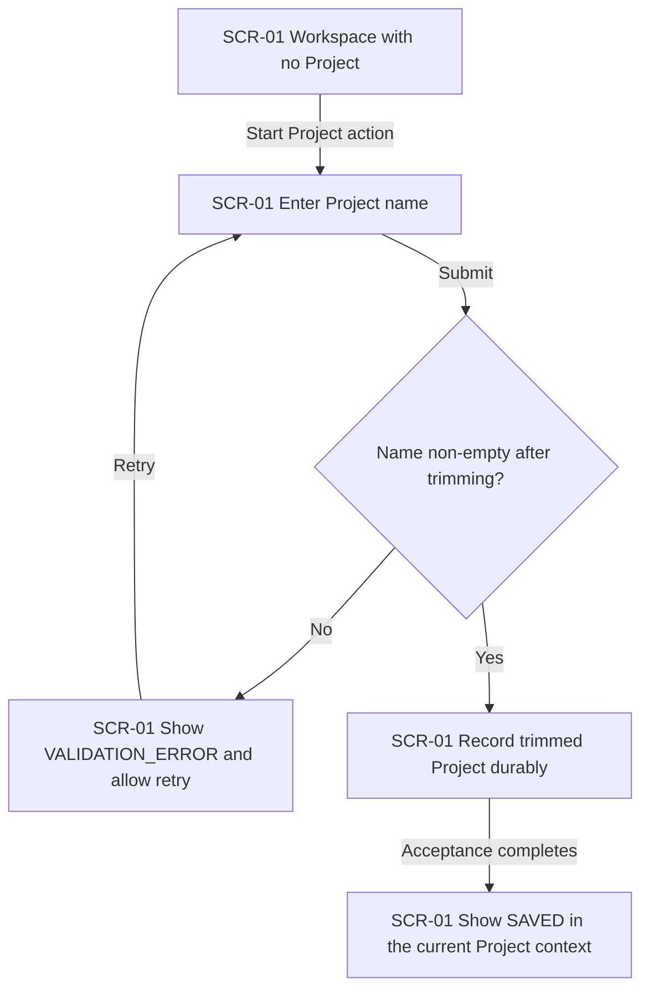
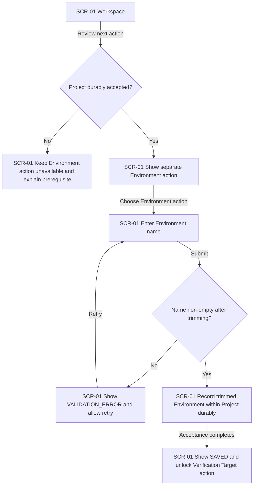
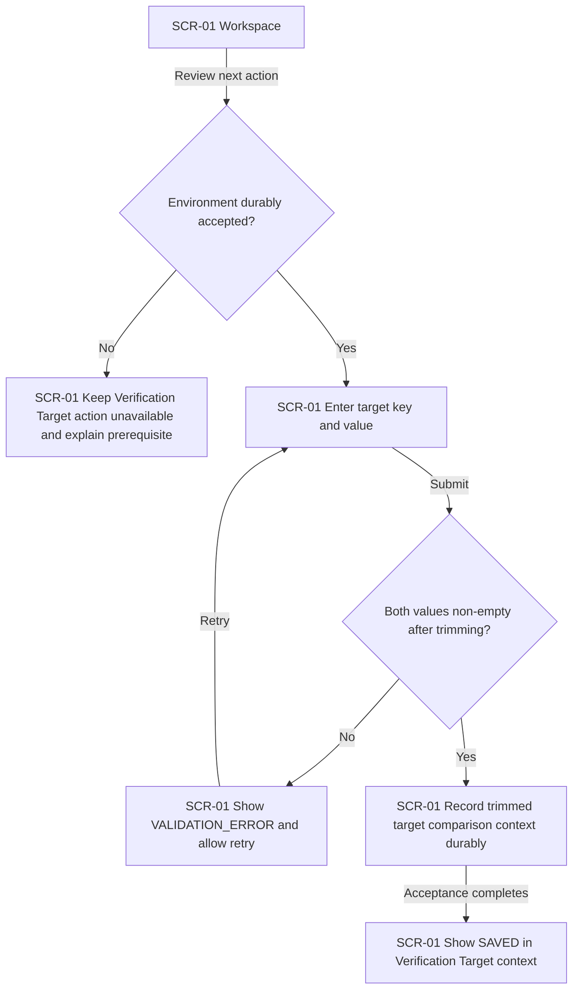
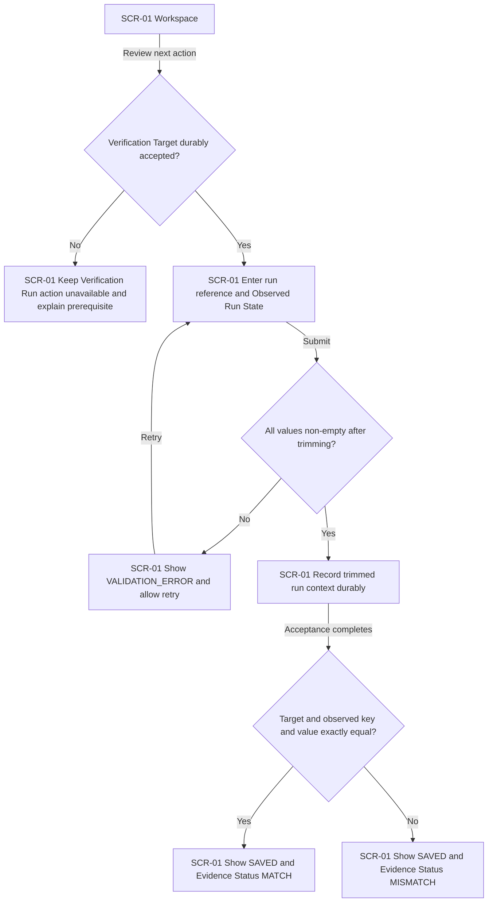
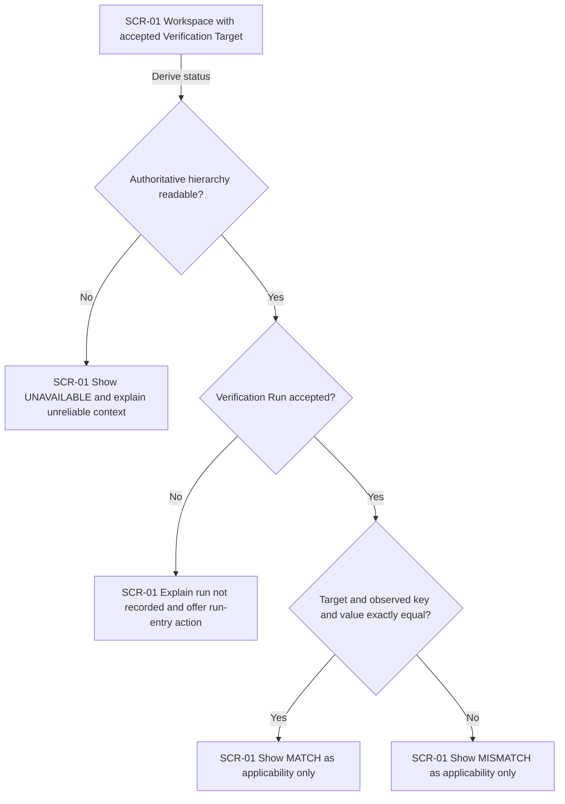
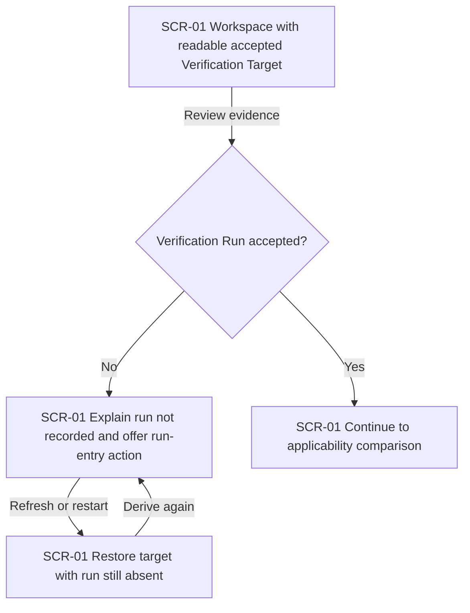
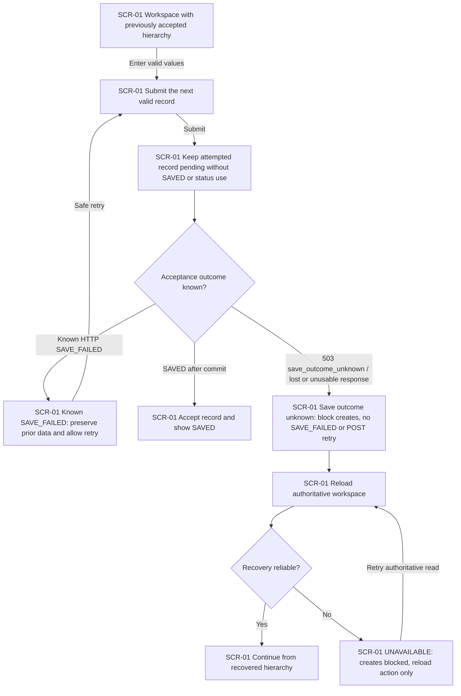
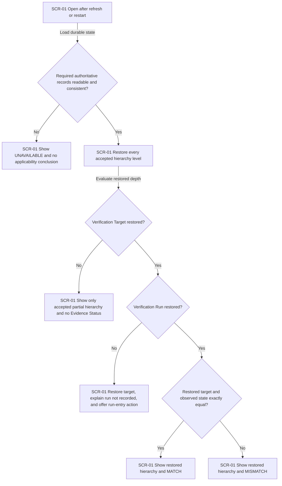
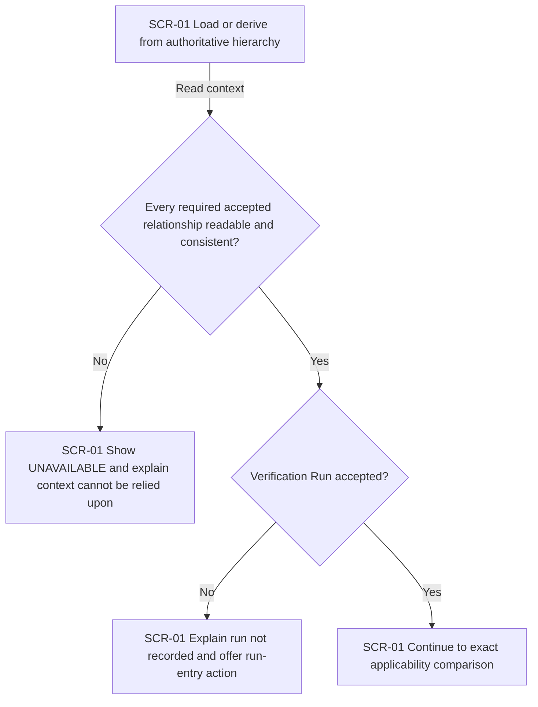

# UX flows — walking-skeleton-readiness

> User flows for every UI-touching §4 user story, produced by `ux-flows` (after `clarify`, before
> `design`) and read by `design` (evidence for the target-surface and UI-architecture decisions),
> `sequences` (UI-driven flows align on SCR ids), `screens` (details every inventory row), and
> `plan-tests` (the e2e-through-UI paths). Always markdown plus Mermaid `flowchart`, whatever the
> design tool; this artifact is flow-altitude, not visual design.

## Platform decisions

- **Posture:** desktop-first, web workspace — confirmed for this flow set and now governed by `docs/design-system.md`.
- The experience is one progressive evidence-applicability workspace rather than separate wizard pages.
- On initial creation with no Project, the sole accepted Project is current without a separate activation action. Repeated HTTP creates remain allowed; current selection then means greatest visible accepted UUID, with descendants parent-scoped, not exact acceptance chronology ([data-model.md](./data-model.md#current-hierarchy-validity-ac-20)). Explicit multiple-record selection remains deferred.
- A successful Project save ends in the normal Project context; it does not automatically open or show the Environment creation prompt.
- Configuration-stage saves do not automatically show Evidence Status. Before a run exists, the UI shows workflow guidance and the run-entry action while domain logic may derive `NO_EVIDENCE`; the UI does not render `NO_EVIDENCE` as an assessment result beside `MATCH` and `MISMATCH`.
- Once a run context is durably accepted, the UI automatically shows `MATCH` or `MISMATCH`; `UNAVAILABLE` remains user-visible whenever authoritative context cannot be relied upon.
- Each dependent recording action becomes available only after its parent record has been durably accepted.
- Validation, save, recovery, and Evidence Status outcomes remain in the workspace so the QA engineer can understand the current context and retry where permitted. A known HTTP SAVE_FAILED allows save retry; a server-side unknown acceptance result or unknown POST transport outcome requires authoritative workspace recovery before continuing (SAD §6).

## Screen inventory

| ID | Screen | Purpose | Entry | Exit |
|---|---|---|---|---|
| SCR-01 | Evidence applicability workspace | Progressively record and restore the hierarchy, show operation outcomes, and explain Evidence Status. | Open, refresh, or return after an application restart. | Remain to perform the next available action or close the browser. |

## Flows

### Flow: US-01 — Create Project

The QA engineer opens the workspace without a Project and submits a name. An empty trimmed value produces `VALIDATION_ERROR`, records nothing, and returns to the same action for retry. A valid value is trimmed and durably accepted without further normalization; for the one-record Walking Skeleton, acceptance makes it the current Project context without a separate activation action and only then produces `SAVED`. Environment creation remains a separate available action; the workspace does not automatically open or show its prompt.

### Flow: US-02 — Create Environment

The workspace first checks whether a Project has been durably accepted. Without one, the Environment action is unavailable and the workspace explains the prerequisite, so nothing is accepted. With the current Project context, the separate Environment action is available and opens only when the QA engineer chooses it. An empty trimmed Environment name produces `VALIDATION_ERROR` and a retry path; a valid trimmed name is durably recorded inside the Project, followed by `SAVED` and availability of the Verification Target action.

### Flow: US-03 — Define Verification Target

The QA engineer can define a Verification Target only after an Environment has been durably accepted; otherwise the action remains unavailable and the missing prerequisite is explained. When available, either empty trimmed input produces `VALIDATION_ERROR` and a retry path. Valid key and value inputs are trimmed, preserved otherwise, and durably recorded as comparison context; the workspace then shows `SAVED` in the normal Verification Target context. It does not render `NO_EVIDENCE` as an assessment result; the separate Verification Run action becomes available, and the UI will automatically show `MATCH` or `MISMATCH` only after a run context is durably accepted.

### Flow: US-04 — Record external Verification Run

The Verification Run action is available only after a Verification Target has been durably accepted; otherwise the workspace explains the prerequisite and accepts nothing. Empty trimmed run-reference, observed-key, or observed-value input produces `VALIDATION_ERROR` and permits retry. Valid inputs are trimmed and durably accepted, then compared case-sensitively without further normalization: exact key-and-value equality shows `SAVED` with `MATCH`, while either difference shows `SAVED` with `MISMATCH`.

### Flow: US-05 — Understand Evidence Status

When the workspace derives Evidence Status, unreadable or inconsistent authoritative context produces user-visible `UNAVAILABLE` and no applicability conclusion. With readable context but no accepted Verification Run, domain logic may derive `NO_EVIDENCE`, while the UI instead explains that a run has not been recorded and offers the run-entry action; it does not render `NO_EVIDENCE` as an assessment result. Once a run context is durably accepted, the trimmed values are compared case-sensitively and the UI automatically shows `MATCH` for exact target and observed key-and-value equality or `MISMATCH` for any difference; both are explicitly explained as evidence applicability only, never test outcome or release Readiness.

### Flow: US-06 — Recognize missing evidence

With a readable accepted Verification Target, the workspace distinguishes the absence of a Verification Run from an applicability result. Domain logic may derive `NO_EVIDENCE`, but the UI does not render it as an assessment result; it explains that a run has not been recorded and offers the run-entry action. Refresh or restart restores the target and the continued absence of a run, then reproduces the same workflow guidance. If a run exists, the flow leaves this missing-evidence path and continues to applicability comparison.

### Flow: US-07 — Retry unsuccessful saves

While acceptance is pending, the workspace does not show `SAVED` or use the attempted record for Evidence Status. A received operation-specific HTTP `503 *.save_failed` confirms non-acceptance: show `SAVE_FAILED`, preserve prior hierarchy, and allow safe retry. A received operation-specific `503 *.save_outcome_unknown` can reflect lost PostgreSQL COMMIT acknowledgement. A lost or unusable POST response also leaves acceptance unknown: show explanatory recovery feedback, block creates, and reload `GET /api/v1/workspace` without repeating the POST. Continue from recovered server state without inferring `SAVED` or `SAVE_FAILED` for the uncertain attempt. Any new create requires an explicit user action; absence in a GET snapshot is not rollback proof or a duplicate-free retry guarantee. Failed recovery shows `UNAVAILABLE` and permits GET retry only. No idempotency machinery is introduced.

### Flow: US-08 — Recover persisted evidence context

After refresh or restart, the workspace reads the authoritative durable hierarchy. An unreadable, malformed, or inconsistent required record produces user-visible `UNAVAILABLE` and no applicability conclusion. A reliable read restores exactly the accepted levels: a partial hierarchy before Verification Target shows no Evidence Status; for a target without a run, domain logic may derive `NO_EVIDENCE` while the UI explains that a run has not been recorded and offers the run-entry action; and a complete run context reproduces the same case-sensitive `MATCH` or `MISMATCH` result as before restart.

### Flow: US-09 — Recognize unavailable evidence status

Whenever recovery or status derivation cannot reliably read an authoritative record or finds malformed or inconsistent accepted relationships, the workspace shows `UNAVAILABLE`, explains that the evidence context cannot currently be relied upon, and withholds `MATCH` and `MISMATCH`. A successful reliable read does not use `UNAVAILABLE`: when no run is accepted, domain logic may derive `NO_EVIDENCE` while the UI shows workflow guidance and the run-entry action instead of a status result; when a run exists, the UI proceeds to exact applicability comparison.

## Out-of-scope user stories

None. Every §4 user story describes a QA engineer interacting with the browser workspace and therefore has a UI flow above.

## AC coverage

| AC | Shown by | Notes |
|---|---|---|
| AC-01 | Flow US-01 → valid-name and durable-acceptance branch | `SAVED` appears only after acceptance; the sole created Project becomes current without automatically opening Environment creation. |
| AC-02 | Flow US-01 → empty-trimmed-name branch | Records nothing and returns to retry. |
| AC-03 | Flow US-02 → accepted-Project and valid-name branch | Records the Environment within the Project. |
| AC-04 | Flow US-02 → missing-Project branch | Action is unavailable and the prerequisite is explained; nothing is accepted. |
| AC-05 | Flow US-02 → empty-trimmed-name branch | Shows `VALIDATION_ERROR` and allows retry. |
| AC-06 | Flow US-03 → accepted-Environment and valid-target branch | Records the target as comparison context. |
| AC-07 | Flow US-03 → missing-Environment branch | Action is unavailable and the prerequisite is explained; nothing is accepted. |
| AC-08 | Flow US-03 → incomplete-target branch | Either empty trimmed field produces `VALIDATION_ERROR` and retry. |
| AC-09 | Flow US-05 → readable context without run; Flow US-06 → no-run branch | Domain logic may derive `NO_EVIDENCE`; the UI instead explains that no run is recorded and offers the run-entry action. |
| AC-10 | Flow US-04 → exact-equality branch; Flow US-05 → exact-equality branch | Durable run acceptance leads to `MATCH`. |
| AC-11 | Flow US-04 → difference branch; Flow US-05 → difference branch | Durable run acceptance leads to `MISMATCH`. |
| AC-12 | Flow US-04 → incomplete-run-context branch | Shows `VALIDATION_ERROR`, records no run, and allows retry. |
| AC-13 | Flow US-04 → missing-Verification-Target branch | Action is unavailable and the prerequisite is explained; nothing is accepted. |
| AC-14 | Flow US-05 → exact comparison decision | Exact key-and-value equality is the only `MATCH` path. |
| AC-14a | Flows US-01, US-02, US-03, US-04 → accepted-text branches; Flow US-05 → comparison decision | Accepted values are trimmed, otherwise preserved, and comparisons are case-sensitive. |
| AC-15 | Flow US-05 → `MATCH` and `MISMATCH` branches | Both outcomes are explained as applicability only, not outcome or Readiness. |
| AC-16 | Flow US-07 → known HTTP SAVE_FAILED branch | Shows `SAVE_FAILED`, preserves prior accepted data, and permits retry only when non-acceptance is known. |
| AC-16a | Flow US-07 → unknown outcome / GET recovery branches | Server-side uncertainty and response loss both require authoritative recovery, with no POST replay or invented acceptance outcome. |
| AC-17 | Flow US-07 → pending-acceptance state | No `SAVED` or Evidence Status use before durable acceptance. |
| AC-17a | Flows US-02, US-03, US-04 → missing-parent branches | Dependent actions are unavailable until their parents are accepted. |
| AC-18 | Flow US-08 → complete hierarchy and exact-comparison branches | Restores the entire hierarchy and reproduces `MATCH` or `MISMATCH`. |
| AC-19 | Flow US-06 → refresh/restart loop; Flow US-08 → restored target without run | Restores the hierarchy and domain `NO_EVIDENCE`, while the UI restores workflow guidance and the run-entry action rather than a status result. |
| AC-19a | Flow US-08 → partial-hierarchy branch | Restores only accepted levels and shows no Evidence Status before a target exists. |
| AC-20 | Flow US-08 → unreliable-read branch; Flow US-09 → unreliable-context branch | Produces user-visible `UNAVAILABLE`, explanation, and no applicability conclusion; reliable no-run reads use the AC-09 UI behavior. |
